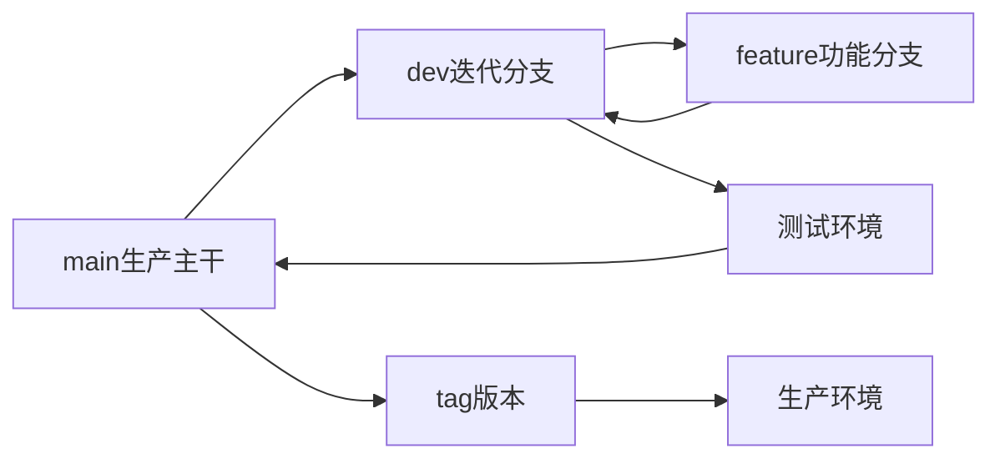

# Git 团队分支管理与标准开发规范（推荐版）

## 一、适用范围

适用于：

* 单生产版本模式
* 线上只维护当前最新版本
* 迭代式发布升级
* 多人并行开发
* 无历史版本长期维护需求

采用：

> 短生命周期 Feature 分支 + 迭代集成 Dev 分支 + Main 生产主干 + Tag 发布模式

---

# 二、分支模型

仓库长期只保留：

```text
main
dev/*
feature/*
fix/*
```

不允许长期存在其他分支。

---

# 1. main 主干分支（永久）

分支：

```text
main
```

定位：

> 唯一生产基线，所有正式版本来源。

规则：

* 永远保持可发布状态
* 禁止直接 push
* 所有修改必须 Pull Request
* 必须通过 CI
* 必须 Code Review
* 禁止合入未测试代码

main 只接收：

```
dev/*  ---> main
fix/*  ---> main
```

不接受：

```
feature/* ---> main
```

---

# 2. dev 迭代集成分支（临时）

命名：

```text
dev/YYYYMMDD
```

示例：

```
dev/20260720
dev/order-refactor
```

作用：

> 当前一次迭代的功能集成、测试分支。

生命周期：

```
创建
 ↓
开发
 ↓
测试
 ↓
合并main
 ↓
删除
```

创建：

```bash
git checkout main
git pull
git checkout -b dev/20260720
```

规则：

* 从最新 main 创建
* 汇总当前迭代所有功能
* 提供测试环境部署
* 不直接生产部署

允许：

```
feature/*
       |
       v
dev/*
```

发布：

```
dev/*
 |
 |
 v
main
 |
 |
 tag
```

---

# 3. Feature 功能分支

命名：

```
feature/{功能}/{开发者}
```

示例：

```
feature/order-payment/zhangsan
feature/user-center/lisi
```

用途：

开发新功能。

规则：

* 从 dev 创建
* 独立开发
* 完成后 PR 合入 dev
* 合并后删除

流程：

```text
dev
 |
 |
feature/order
 |
 |
PR
 |
 |
dev
```

禁止：

```
feature ---> main
```

---

# 4. Fix 修复分支

命名：

```
fix/{问题描述}
```

例如：

```
fix/login-token-expire
fix/order-price-error
```

根据问题来源选择基线。

## 情况1：线上生产 Bug

来源：

```
main
```

流程：

```
main
 |
fix
 |
main
 |
dev merge main
```

例如：

```text
线上发现支付错误

main
 |
fix/payment-error
 |
main
 |
生产发布
```

---

## 情况2：测试阶段 Bug

来源：

```
dev/*
```

流程：

```
dev
 |
fix
 |
dev
```

不影响 main。

---

# 三、多人协作规范

## 1. 大功能多人开发

采用：

> 功能负责人分支 + 个人子分支

结构：

```text
dev/order-system

        |
        |
        +-- feature/order-user/a
        |
        +-- feature/order-pay/b
        |
        +-- feature/order-test/c
```

流程：

1. 从 dev 创建大功能分支

```
feature/order-system
```

2. 成员创建个人分支

```
feature/order-system/alice
feature/order-system/bob
```

3. 完成功能后：

```
个人分支
    |
    v
功能主分支
    |
    v
dev
```

优势：

* 避免多人修改冲突
* 大功能未完成不会污染测试环境
* 支持多人并行开发

---

# 四、标准开发流程

## 1. 新功能开发

创建：

```
main
 |
dev
 |
feature
```

流程：

```
dev
 |
feature开发
 |
PR
 |
dev测试
 |
main发布
 |
tag
```

---

## 2. 测试环境部署

部署来源：

```
dev/*
```

例如：

```
dev/20260720
```

自动部署：

```
测试环境
```

---

## 3. 正式发布流程

测试完成：

```
dev/20260720

        |
        |
        v

main

        |
        |
        v

tag:v1.4.0

        |
        |
        v

生产环境
```

---

# 五、版本 Tag 规范

Tag 只表示代码版本。

采用：

Semantic Versioning：

```
v主版本.次版本.修订版本
```

例如：

```
v1.0.0
v1.1.0
v1.1.1
v2.0.0
```

含义：

| 版本    | 说明    |
| ----- | ----- |
| major | 破坏性升级 |
| minor | 新增功能  |
| patch | Bug修复 |

---

测试版本：

使用预发布版本：

```
v1.5.0-alpha.1
v1.5.0-beta.1
v1.5.0-rc.1
```

含义：

```
alpha
内部开发测试

beta
功能测试

rc
生产候选版本
```

正式：

```
v1.5.0
```

---

# 六、环境映射规范

不要通过 tag 名区分环境。

由 CI/CD 决定：

| 代码来源      | 环境    |
| --------- | ----- |
| feature/* | 开发环境  |
| dev/*     | 测试环境  |
| main      | 预发布环境 |
| tag       | 生产环境  |

例如：

```text
feature/order
        |
        ↓
开发环境


dev/20260720
        |
        ↓
测试环境


tag:v1.3.0
        |
        ↓
生产环境
```

---

# 七、同步规则

## main 更新

当 main 有修复：

同步：

```
main
 |
 |
dev merge main
```

方向：

```
main → dev
```

允许。

禁止：

```
dev → main
```

除正式发布外。

---

# 八、代码提交规范

采用 Conventional Commit：

格式：

```
type(scope): description
```

示例：

```
feat(user): add login api

fix(order): fix payment error

refactor(cache): optimize redis layer

docs(api): update document
```

类型：

| 类型       | 用途   |
| -------- | ---- |
| feat     | 新功能  |
| fix      | 修复   |
| refactor | 重构   |
| docs     | 文档   |
| test     | 测试   |
| chore    | 工程维护 |

---

# 九、PR规则

main：

必须：

* Code Review
* CI通过
* 禁止直接push

dev：

必须：

* CI通过
* 至少一人审核

---

# 十、最终工作流



---

## 最终原则

一句话：

> feature 负责开发，dev 负责集成测试，main 负责生产稳定，tag 负责版本冻结，CI/CD 负责环境发布。

这个版本比传统 GitFlow 更轻量，也更符合现在中小团队和 SaaS 产品的实际开发方式。
