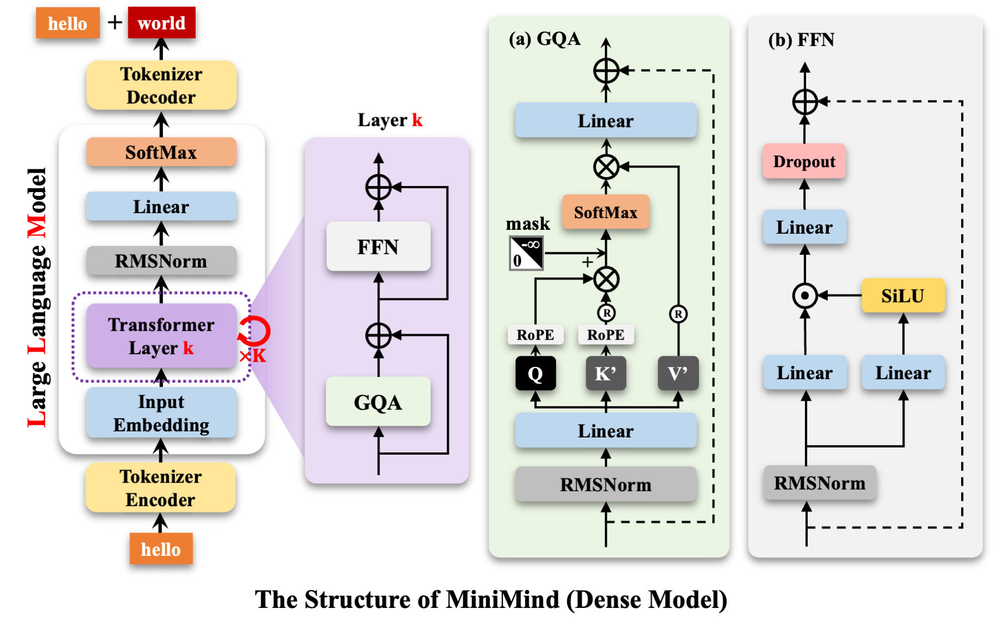
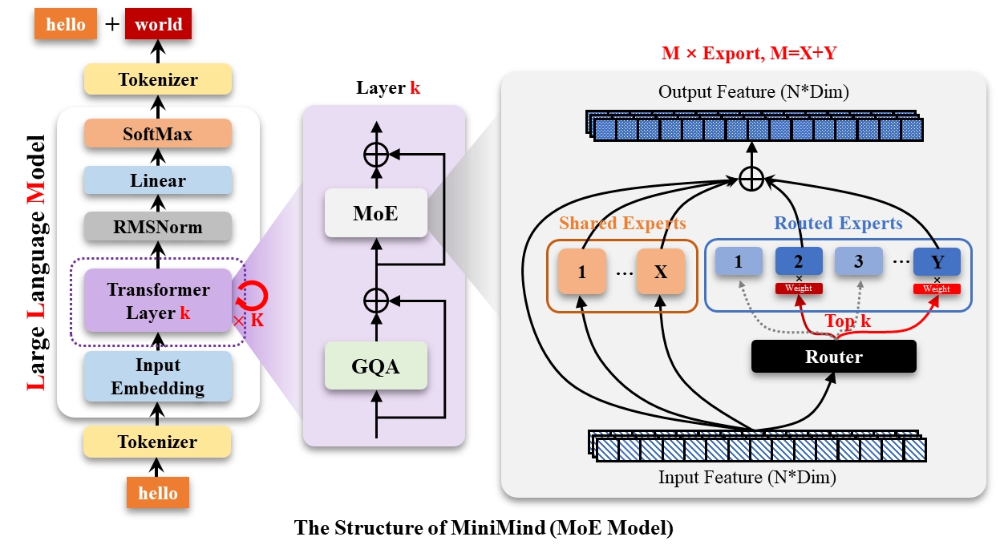


# LLM Fine-tuning


## 架构



1. hello输入，经过tokenizer转化为某个id，然后embedding转化为向量，进入Transformer
2. 首先经过GQA，在内部RMSNorm，不用减去平均值的正则化，防止梯度问题
3. 然后在Linear层里和QKV矩阵计算，获取对应向量，其中Q和K进行RoPE位置编码，然后点积，掩码处理后softmax，获得一个“相关性矩阵”，然后输入V点积，获得具体的上下文侧重信息，最后送入一个Linear层，将多头的多个向量拼接，投影回原维度，最后加上最初的输入，实现残差
4. GQA层之后也加上最初的embedding，保证残差，之后送入FFN
5. 在FFN里进行归一化RMSNorm，然后进行SwiGLU门控，左侧的Linear负责升维，右侧进入SiLU，非线性激活，然后两个线性层处理后的内容进行计算（不清楚这里是什么符号 ），之后送入新的Linear层浓缩降维，最后Dropout一部分防止过拟合，依旧残差处理
6. 出FFN之后依旧应用残差
7. 出Transformer层之后RMSNorm进行归一化，然后Linear层，得到整个词汇表每个词的得分
8. 之后softmax变为概率，然后再反向tokenizer转化为具体的词world

## LoRA


## pretrain

### 训练代码
``` py
from ast import arg
import os
import sys


__package__ = "trainer"
sys.path.append(os.path.abspath(os.path.join(os.path.dirname(__file__), "..")))

import argparse  # 命令行参数解析
import time  # 时间统计
import warnings  # 警告控制
import torch
import torch.distributed as dist  # 分布式训练支持
from contextlib import nullcontext  # 上下文管理器
from torch import optim, nn  # 优化器和神经网络模块
from torch.nn.parallel import DistributedDataParallel  # 分布式数据并行
from torch.utils.data import DataLoader, DistributedSampler  # 数据加载器

from model.MokioModel import MokioMindConfig
from dataset.lm_dataset import PretrainDataset
from trainer.trainer_utils import (  # 训练工具函数
    get_lr,
    Logger,
    is_main_process,
    lm_checkpoint,
    init_distributed_mode,
    setup_seed,
    init_model,
    SkipBatchSampler,
)

# 忽略警告信息，保持输出清洁
warnings.filterwarnings("ignore")


def train_epoch(epoch, loader, iters, start_step=0, wandb=None):
    start_time = time.time()  # 记录epoch开始时间

    # 遍历数据批次循环
    for step, (input_ids, attention_mask, labels) in enumerate(
        loader, start=start_step + 1
    ):
        # 将数据移动到指定设备，一般是GPU
        input_ids = input_ids.to(args.device)
        attention_mask = attention_mask.to(args.device)
        labels = labels.to(args.device)

        lr = get_lr(
            epoch * iters + step, args.epochs * iters, args.learning_rate
        )  # 计算当前学习率

        for param_group in optimizer.param_groups:
            param_group["lr"] = lr  # 更新优化器的学习率

        with autocast_ctx:
            # 向前传播
            res=model(input_ids=input_ids, attention_mask=attention_mask, labels=labels)
            # 计算loss
            loss=res.loss+res.aux_loss
            loss=loss/args.accumulation_steps  # 平均化损失，适应梯度累积
        scaler.scale(loss).backward()
        # 梯度累积
        if (step+1)%args.accumulation_steps==0:
            scaler.unscale_(optimizer)  # 在梯度裁剪前取消缩放
            torch.nn.utils.clip_grad_norm_(model.parameters(), args.grad_clip)  
            scaler.step(optimizer)  # 更新参数
            scaler.update()  # 更新缩放器
            optimizer.zero_grad(set_to_none=True)  # 清零梯度

        if step % args.log_interval == 0 or step == iters - 1:
            spend_time = time.time() - start_time
            current_loss = loss.item() * args.accumulation_steps  # 恢复真实损失值
            current_lr = optimizer.param_groups[-1]["lr"]  # 当前学习率

            eta_min = spend_time / (step + 1) * iters // 60 - spend_time // 60

            Logger(
                f"Epoch:[{epoch + 1}/{args.epochs}]({step}/{iters}) loss:{current_loss:.6f} lr:{current_lr:.12f} epoch_Time:{eta_min}min:"
            )

            # 记录到实验跟踪系统
            if wandb:
                wandb.log(
                    {"loss": current_loss, "lr": current_lr, "epoch_Time": eta_min}
                )

        if (step % args.save_interval == 0 or step == iters - 1) and is_main_process():
            model.eval()  # 切换到评估模式

            # 构建保存路径
            moe_suffix = (
                "_moe" if hasattr(lm_config, "use_moe") and lm_config.use_moe else ""
            )
            ckp = f"{args.save_dir}/{args.save_weight}_{lm_config.hidden_size}{moe_suffix}.pth"

            # 📚 分布式模型保存知识点
            # DDP模型需要通过.module访问真正的模型
            if isinstance(model, torch.nn.parallel.DistributedDataParallel):
                state_dict = model.module.state_dict()
            else:
                state_dict = model.state_dict()

            # 📚 半精度保存知识点
            # 将float32参数转为float16，减少存储空间
            state_dict = {k: v.half() for k, v in state_dict.items()}
            torch.save(state_dict, ckp)

            # 保存完整训练状态
            lm_checkpoint(
                lm_config,
                weight=args.save_weight,
                model=model,
                optimizer=optimizer,
                scaler=scaler,
                epoch=epoch,
                step=step,
                wandb=wandb,
                save_dir="../checkpoints",  # ！修正：原"checkpoints"缺少../前缀
            )

            model.train()  # 恢复训练模式


if __name__ == "__main__":
    parser = argparse.ArgumentParser(description="MokioMind Pretraining")

    # ========== 基础训练参数 ==========
    parser.add_argument(
        "--save_dir", type=str, default="../out", help="模型保存目录"
    )  # ！修正：原"out"缺少../前缀
    parser.add_argument(
        "--save_weight", default="pretrain", type=str, help="保存权重的前缀名"
    )
    parser.add_argument(
        "--epochs", type=int, default=1, help="训练轮数（建议1轮zero或2-6轮充分训练）"
    )
    parser.add_argument("--batch_size", type=int, default=32, help="batch size")
    parser.add_argument("--learning_rate", type=float, default=5e-4, help="初始学习率")

    # ========== 硬件和性能参数 ==========
    parser.add_argument(
        "--device",
        type=str,
        default="cuda:0" if torch.cuda.is_available() else "cpu",
        help="训练设备",
    )
    parser.add_argument("--dtype", type=str, default="bfloat16", help="混合精度类型")
    parser.add_argument("--num_workers", type=int, default=1, help="数据加载线程数")

    # ========== 训练策略参数 ==========
    parser.add_argument(
        "--accumulation_steps", type=int, default=8, help="梯度累积步数"
    )
    parser.add_argument("--grad_clip", type=float, default=1.0, help="梯度裁剪阈值")
    parser.add_argument("--log_interval", type=int, default=100, help="日志打印间隔")
    parser.add_argument("--save_interval", type=int, default=100, help="模型保存间隔")

    # ========== 模型架构参数 ==========
    parser.add_argument("--hidden_size", default=512, type=int, help="隐藏层维度")
    parser.add_argument("--num_hidden_layers", default=8, type=int, help="隐藏层数量")
    parser.add_argument(
        "--max_seq_len", default=512, type=int, help="训练的最大截断长度"
    )
    parser.add_argument(
        "--use_moe",
        default=0,
        type=int,
        choices=[0, 1],
        help="是否使用MoE架构（0=否，1=是）",
    )

    # ========== 数据和恢复参数 ==========
    parser.add_argument(
        "--data_path",
        type=str,
        default="../dataset/pretrain_hq.jsonl",  # ！修正：原"dataset/..."缺少../前缀
        help="预训练数据路径",
    )
    parser.add_argument(
        "--from_weight",
        default="none",
        type=str,
        help="基于哪个权重训练，为none则从头开始",
    )
    parser.add_argument(
        "--from_resume",
        default=0,
        type=int,
        choices=[0, 1],
        help="是否自动检测&续训（0=否，1=是）",
    )

    # ========== 实验跟踪参数 ==========
    parser.add_argument("--use_wandb", action="store_true", help="是否使用wandb")
    parser.add_argument(
        "--wandb_project", type=str, default="MokioMind-Pretrain", help="wandb项目名"
    )

    # 解析命令行参数
    args = parser.parse_args()

    # ========== 1. 初始化环境和随机种子 ==========
    """
    📚 分布式训练初始化知识点：
    - local_rank: 当前进程在本机上的GPU编号
    - 随机种子: 确保不同进程有不同但可复现的随机序列
    - 这样既保证了随机性，又保证了可复现性
    """
    local_rank = init_distributed_mode()
    if dist.is_initialized():
        args.device = f"cuda:{local_rank}"  # 分布式训练时使用对应的GPU

    # 📚 随机种子设置知识点
    # 不同进程使用不同的种子，避免数据采样完全相同
    # 42是基础种子，每个进程加上自己的rank保证不同
    setup_seed(42 + (dist.get_rank() if dist.is_initialized() else 0))

    # ========== 2. 配置目录、模型参数、检查点 ==========
    """
    📚 模型配置和检查点管理：
    - 创建保存目录
    - 构建模型配置对象
    - 尝试加载断点续训数据
    """
    os.makedirs(args.save_dir, exist_ok=True)  # 确保保存目录存在

    # 创建MiniMind模型配置
    lm_config = MokioMindConfig(
        hidden_size=args.hidden_size,
        num_hidden_layers=args.num_hidden_layers,
        use_moe=bool(args.use_moe),
    )

    # 📚 断点续训知识点
    # 如果开启了断点续训，尝试加载之前的训练状态
    ckp_data = (
        lm_checkpoint(
            lm_config, weight=args.save_weight, save_dir="../checkpoints"
        )  # ！修正：原"checkpoints"缺少../前缀
        if args.from_resume == 1
        else None
    )

    # ========== 3. 设置混合精度 ==========
    """
    📚 混合精度训练知识点：
    - bfloat16: Google开发，数值范围大，更稳定
    - float16: 标准半精度，节省内存但可能溢出
    - autocast: 自动选择精度，关键运算用float32
    """
    device_type = "cuda" if "cuda" in args.device else "cpu"
    dtype = torch.bfloat16 if args.dtype == "bfloat16" else torch.float16

    # 📚 上下文管理器知识点
    # CPU不支持autocast，使用nullcontext作为空操作
    autocast_ctx = (
        nullcontext() if device_type == "cpu" else torch.cuda.amp.autocast(dtype=dtype)
    )

    # ========== 4. 配置WandB实验跟踪 ==========
    """
    📚 实验跟踪系统知识点：
    - WandB: 实验管理平台，记录训练过程
    - SwanLab: 国产替代方案
    - 支持断点续训时恢复到同一个实验
    """
    wandb = None
    if args.use_wandb and is_main_process():
        # 使用SwanLab作为WandB的替代
        import swanlab as wandb

        # 📚 实验恢复知识点
        # 如果有检查点数据，获取之前的wandb_id来恢复实验
        wandb_id = ckp_data.get("wandb_id") if ckp_data else None
        resume = "must" if wandb_id else None  # 必须恢复到指定实验

        # 构建实验名称，包含关键超参数
        wandb_run_name = f"MokioMind-Pretrain-Epoch-{args.epochs}-BatchSize-{args.batch_size}-LearningRate-{args.learning_rate}"
        wandb.init(
            project=args.wandb_project, name=wandb_run_name, id=wandb_id, resume=resume
        )

    # ========== 5. 定义模型、数据、优化器 ==========
    """
    📚 训练组件初始化：
    - 模型: 根据配置创建MiniMind模型
    - 数据集: 加载预训练数据
    - 采样器: 分布式训练的数据分配
    - 优化器: AdamW优化器
    - 缩放器: 混合精度训练的梯度缩放
    """
    # 初始化模型和分词器
    model, tokenizer = init_model(lm_config, args.from_weight, device=args.device)

    train_ds = PretrainDataset(args.data_path, tokenizer, max_length=args.max_seq_len)

    train_sampler = DistributedSampler(train_ds) if dist.is_initialized() else None

    scaler = torch.cuda.amp.GradScaler(enabled=(args.dtype == "float16"))

    optimizer = optim.AdamW(model.parameters(), lr=args.learning_rate)

    start_epoch, start_step = 0, 0
    if ckp_data:
        # 恢复模型参数
        model.load_state_dict(ckp_data["model"])
        # 恢复优化器状态（动量、方差估计等）
        optimizer.load_state_dict(ckp_data["optimizer"])
        # 恢复梯度缩放器状态
        scaler.load_state_dict(ckp_data["scaler"])
        # 恢复训练进度
        start_epoch = ckp_data["epoch"]
        start_step = ckp_data.get("step", 0)

    if dist.is_initialized():
        # 📚 RoPE位置编码特殊处理
        # freqs_cos, freqs_sin是位置编码缓存，不需要梯度同步
        model._ddp_params_and_buffers_to_ignore = {"freqs_cos", "freqs_sin"}
        model = DistributedDataParallel(model, device_ids=[local_rank])

    for epoch in range(start_epoch, args.epochs):
        # 📚 分布式采样器epoch设置
        # 每个epoch设置不同的随机种子，确保数据顺序随机化
        if train_sampler:
            train_sampler.set_epoch(epoch)

        # 📚 断点续训逻辑
        if epoch == start_epoch and start_step > 0:  # 第一个epoch且存在检查点
            # 使用跳批采样器，跳过已训练的数据
            batch_sampler = SkipBatchSampler(
                train_sampler or range(len(train_ds)), args.batch_size, start_step + 1
            )
            loader = DataLoader(
                train_ds,
                batch_sampler=batch_sampler,
                num_workers=args.num_workers,
                pin_memory=True,
            )
            Logger(
                f"Epoch [{epoch + 1}/{args.epochs}]: 跳过前{start_step}个step，从step {start_step + 1}开始"
            )
            train_epoch(epoch, loader, len(loader) + start_step + 1, start_step, wandb)
        else:  # 默认从头开始
            loader = DataLoader(
                train_ds,
                batch_size=args.batch_size,
                shuffle=(train_sampler is None),
                sampler=train_sampler,
                num_workers=args.num_workers,
                pin_memory=True,
            )
            train_epoch(epoch, loader, len(loader), 0, wandb)

```

### 数据集代码

``` py
class PretrainDataset(Dataset):

        def __init__(self, data_path, tokenizer, max_length=512):
            super().__init__()
            self.tokenizer = tokenizer
            self.max_length = max_length # 输入给GPU的最大长度
            # 使用 HuggingFace datasets 的惰性加载，避免一次性读入大文件
            self.samples = load_dataset("json", data_files=data_path, split="train")

        def __len__(self):
            return len(self.samples)

        # 我们拿到的是，jsonl里的每一行
        def __getitem__(self, index):
            sample=self.samples[index]
             
            # tokenizer把文本转化为input_id
            tokens=self.tokenizer(
                 str(sample["text"]), # 这里假设jsonl里有一个"text"字段，包含了文本内容
                 add_special_tokens=False,
                 max_length=self.max_length - 2, # 留出位置给BOS和EOS
                 truncation=True, #如果长度超过了max，自动剪切
            ).input_ids
            # 需要加上EOS，BOS，以及PAD填充
            tokens=[self.tokenizer.bos_token_id] + tokens + [self.tokenizer.eos_token_id]
            input_ids=tokens+[self.tokenizer.pad_token_id]*(self.max_length-len(tokens)) # 填充到max_length
            input_ids=torch.tensor(input_ids,dtype=torch.long) # 转成tensor
            # 需要自行编写labels，防止PAD参与loss计算
            labels=input_ids.clone()
            labels[labels == self.tokenizer.pad_token_id] = -100 # 将PAD位置的标签设为-100，表示忽略这些位置的loss计算
            # 需要编写attention_mask，告诉模型哪些位置是有效的，哪些位置是PAD
            attention_mask=(input_ids != self.tokenizer.pad_token_id).long() # 非PAD位置为1，PAD位置为0
            # 我们要输出的，是input_ids, attention_mask, labels

            return {
                "input_ids": input_ids,
                "attention_mask": attention_mask,
                "labels": labels
            }
```

## MoE



## PreTrain

### 训练代码

```bash
from ast import arg
import os
import sys

__package__ = "trainer"
sys.path.append(os.path.abspath(os.path.join(os.path.dirname(__file__), "..")))

import argparse  # 命令行参数解析
import time  # 时间统计
import warnings  # 警告控制
import torch
import torch.distributed as dist  # 分布式训练支持
from contextlib import nullcontext  # 上下文管理器
from torch import optim, nn  # 优化器和神经网络模块
from torch.nn.parallel import DistributedDataParallel  # 分布式数据并行
from torch.utils.data import DataLoader, DistributedSampler  # 数据加载器

from model.MokioModel import MokioMindConfig
from dataset.lm_dataset import PretrainDataset
from trainer.trainer_utils import (  # 训练工具函数
    get_lr,
    Logger,
    is_main_process,
    lm_checkpoint,
    init_distributed_mode,
    setup_seed,
    init_model,
    SkipBatchSampler,
)

# 忽略警告信息，保持输出清洁
warnings.filterwarnings("ignore")

def train_epoch(epoch, loader, iters, start_step=0, wandb=None):
    start_time = time.time()  # 记录epoch开始时间

    # 遍历数据批次循环
    for step, (input_ids, attention_mask, labels) in enumerate(
        loader, start=start_step + 1
    ):
        # 将数据移动到指定设备，一般是GPU
        input_ids = input_ids.to(args.device)
        attention_mask = attention_mask.to(args.device)
        labels = labels.to(args.device)

        lr = get_lr(
            epoch * iters + step, args.epochs * iters, args.learning_rate
        )  # 计算当前学习率

        for param_group in optimizer.param_groups:
            param_group["lr"] = lr  # 更新优化器的学习率

        with autocast_ctx:
            # 向前传播
            res=model(input_ids=input_ids, attention_mask=attention_mask, labels=labels)
            # 计算loss
            loss=res.loss+res.aux_loss
            loss=loss/args.accumulation_steps  # 平均化损失，适应梯度累积
        scaler.scale(loss).backward()
        # 梯度累积
        if (step+1)%args.accumulation_steps==0:
            scaler.unscale_(optimizer)  # 在梯度裁剪前取消缩放
            torch.nn.utils.clip_grad_norm_(model.parameters(), args.grad_clip)  
            scaler.step(optimizer)  # 更新参数
            scaler.update()  # 更新缩放器
            optimizer.zero_grad(set_to_none=True)  # 清零梯度

        if step % args.log_interval == 0 or step == iters - 1:
            spend_time = time.time() - start_time
            current_loss = loss.item() * args.accumulation_steps  # 恢复真实损失值
            current_lr = optimizer.param_groups[-1]["lr"]  # 当前学习率

            eta_min = spend_time / (step + 1) * iters // 60 - spend_time // 60

            Logger(
                f"Epoch:{epoch + 1}/{args.epochs} loss:{current_loss:.6f} lr:{current_lr:.12f} epoch_Time:{eta_min}min:"
            )

            # 记录到实验跟踪系统
            if wandb:
                wandb.log(
                    {"loss": current_loss, "lr": current_lr, "epoch_Time": eta_min}
                )

        if (step % args.save_interval == 0 or step == iters - 1) and is_main_process():
            model.eval()  # 切换到评估模式

            # 构建保存路径
            moe_suffix = (
                "_moe" if hasattr(lm_config, "use_moe") and lm_config.use_moe else ""
            )
            ckp = f"{args.save_dir}/{args.save_weight}_{lm_config.hidden_size}{moe_suffix}.pth"

            # 📚 分布式模型保存知识点
            # DDP模型需要通过.module访问真正的模型
            if isinstance(model, torch.nn.parallel.DistributedDataParallel):
                state_dict = model.module.state_dict()
            else:
                state_dict = model.state_dict()

            # 📚 半精度保存知识点
            # 将float32参数转为float16，减少存储空间
            state_dict = {k: v.half() for k, v in state_dict.items()}
            torch.save(state_dict, ckp)

            # 保存完整训练状态
            lm_checkpoint(
                lm_config,
                weight=args.save_weight,
                model=model,
                optimizer=optimizer,
                scaler=scaler,
                epoch=epoch,
                step=step,
                wandb=wandb,
                save_dir="../checkpoints",  # ！修正：原"checkpoints"缺少../前缀
            )

            model.train()  # 恢复训练模式

if __name__ == "__main__":
    parser = argparse.ArgumentParser(description="MokioMind Pretraining")

    # ========== 基础训练参数 ==========
    parser.add_argument(
        "--save_dir", type=str, default="../out", help="模型保存目录"
    )  # ！修正：原"out"缺少../前缀
    parser.add_argument(
        "--save_weight", default="pretrain", type=str, help="保存权重的前缀名"
    )
    parser.add_argument(
        "--epochs", type=int, default=1, help="训练轮数（建议1轮zero或2-6轮充分训练）"
    )
    parser.add_argument("--batch_size", type=int, default=32, help="batch size")
    parser.add_argument("--learning_rate", type=float, default=5e-4, help="初始学习率")

    # ========== 硬件和性能参数 ==========
    parser.add_argument(
        "--device",
        type=str,
        default="cuda:0" if torch.cuda.is_available() else "cpu",
        help="训练设备",
    )
    parser.add_argument("--dtype", type=str, default="bfloat16", help="混合精度类型")
    parser.add_argument("--num_workers", type=int, default=1, help="数据加载线程数")

    # ========== 训练策略参数 ==========
    parser.add_argument(
        "--accumulation_steps", type=int, default=8, help="梯度累积步数"
    )
    parser.add_argument("--grad_clip", type=float, default=1.0, help="梯度裁剪阈值")
    parser.add_argument("--log_interval", type=int, default=100, help="日志打印间隔")
    parser.add_argument("--save_interval", type=int, default=100, help="模型保存间隔")

    # ========== 模型架构参数 ==========
    parser.add_argument("--hidden_size", default=512, type=int, help="隐藏层维度")
    parser.add_argument("--num_hidden_layers", default=8, type=int, help="隐藏层数量")
    parser.add_argument(
        "--max_seq_len", default=512, type=int, help="训练的最大截断长度"
    )
    parser.add_argument(
        "--use_moe",
        default=0,
        type=int,
        choices=[0, 1],
        help="是否使用MoE架构（0=否，1=是）",
    )

    # ========== 数据和恢复参数 ==========
    parser.add_argument(
        "--data_path",
        type=str,
        default="../dataset/pretrain_hq.jsonl",  # ！修正：原"dataset/..."缺少../前缀
        help="预训练数据路径",
    )
    parser.add_argument(
        "--from_weight",
        default="none",
        type=str,
        help="基于哪个权重训练，为none则从头开始",
    )
    parser.add_argument(
        "--from_resume",
        default=0,
        type=int,
        choices=[0, 1],
        help="是否自动检测&续训（0=否，1=是）",
    )

    # ========== 实验跟踪参数 ==========
    parser.add_argument("--use_wandb", action="store_true", help="是否使用wandb")
    parser.add_argument(
        "--wandb_project", type=str, default="MokioMind-Pretrain", help="wandb项目名"
    )

    # 解析命令行参数
    args = parser.parse_args()

    # ========== 1. 初始化环境和随机种子 ==========
    """
    📚 分布式训练初始化知识点：
    - local_rank: 当前进程在本机上的GPU编号
    - 随机种子: 确保不同进程有不同但可复现的随机序列
    - 这样既保证了随机性，又保证了可复现性
    """
    local_rank = init_distributed_mode()
    if dist.is_initialized():
        args.device = f"cuda:{local_rank}"  # 分布式训练时使用对应的GPU

    # 📚 随机种子设置知识点
    # 不同进程使用不同的种子，避免数据采样完全相同
    # 42是基础种子，每个进程加上自己的rank保证不同
    setup_seed(42 + (dist.get_rank() if dist.is_initialized() else 0))

    # ========== 2. 配置目录、模型参数、检查点 ==========
    """
    📚 模型配置和检查点管理：
    - 创建保存目录
    - 构建模型配置对象
    - 尝试加载断点续训数据
    """
    os.makedirs(args.save_dir, exist_ok=True)  # 确保保存目录存在

    # 创建MiniMind模型配置
    lm_config = MokioMindConfig(
        hidden_size=args.hidden_size,
        num_hidden_layers=args.num_hidden_layers,
        use_moe=bool(args.use_moe),
    )

    # 📚 断点续训知识点
    # 如果开启了断点续训，尝试加载之前的训练状态
    ckp_data = (
        lm_checkpoint(
            lm_config, weight=args.save_weight, save_dir="../checkpoints"
        )  # ！修正：原"checkpoints"缺少../前缀
        if args.from_resume == 1
        else None
    )

    # ========== 3. 设置混合精度 ==========
    """
    📚 混合精度训练知识点：
    - bfloat16: Google开发，数值范围大，更稳定
    - float16: 标准半精度，节省内存但可能溢出
    - autocast: 自动选择精度，关键运算用float32
    """
    device_type = "cuda" if "cuda" in args.device else "cpu"
    dtype = torch.bfloat16 if args.dtype == "bfloat16" else torch.float16

    # 📚 上下文管理器知识点
    # CPU不支持autocast，使用nullcontext作为空操作
    autocast_ctx = (
        nullcontext() if device_type == "cpu" else torch.cuda.amp.autocast(dtype=dtype)
    )

    # ========== 4. 配置WandB实验跟踪 ==========
    """
    📚 实验跟踪系统知识点：
    - WandB: 实验管理平台，记录训练过程
    - SwanLab: 国产替代方案
    - 支持断点续训时恢复到同一个实验
    """
    wandb = None
    if args.use_wandb and is_main_process():
        # 使用SwanLab作为WandB的替代
        import swanlab as wandb

        # 📚 实验恢复知识点
        # 如果有检查点数据，获取之前的wandb_id来恢复实验
        wandb_id = ckp_data.get("wandb_id") if ckp_data else None
        resume = "must" if wandb_id else None  # 必须恢复到指定实验

        # 构建实验名称，包含关键超参数
        wandb_run_name = f"MokioMind-Pretrain-Epoch-{args.epochs}-BatchSize-{args.batch_size}-LearningRate-{args.learning_rate}"
        wandb.init(
            project=args.wandb_project, name=wandb_run_name, id=wandb_id, resume=resume
        )

    # ========== 5. 定义模型、数据、优化器 ==========
    """
    📚 训练组件初始化：
    - 模型: 根据配置创建MiniMind模型
    - 数据集: 加载预训练数据
    - 采样器: 分布式训练的数据分配
    - 优化器: AdamW优化器
    - 缩放器: 混合精度训练的梯度缩放
    """
    # 初始化模型和分词器
    model, tokenizer = init_model(lm_config, args.from_weight, device=args.device)

    train_ds = PretrainDataset(args.data_path, tokenizer, max_length=args.max_seq_len)

    train_sampler = DistributedSampler(train_ds) if dist.is_initialized() else None

    scaler = torch.cuda.amp.GradScaler(enabled=(args.dtype == "float16"))

    optimizer = optim.AdamW(model.parameters(), lr=args.learning_rate)

    start_epoch, start_step = 0, 0
    if ckp_data:
        # 恢复模型参数
        model.load_state_dict(ckp_data["model"])
        # 恢复优化器状态（动量、方差估计等）
        optimizer.load_state_dict(ckp_data["optimizer"])
        # 恢复梯度缩放器状态
        scaler.load_state_dict(ckp_data["scaler"])
        # 恢复训练进度
        start_epoch = ckp_data["epoch"]
        start_step = ckp_data.get("step", 0)

    if dist.is_initialized():
        # 📚 RoPE位置编码特殊处理
        # freqs_cos, freqs_sin是位置编码缓存，不需要梯度同步
        model._ddp_params_and_buffers_to_ignore = {"freqs_cos", "freqs_sin"}
        model = DistributedDataParallel(model, device_ids=[local_rank])

    for epoch in range(start_epoch, args.epochs):
        # 📚 分布式采样器epoch设置
        # 每个epoch设置不同的随机种子，确保数据顺序随机化
        if train_sampler:
            train_sampler.set_epoch(epoch)

        # 📚 断点续训逻辑
        if epoch == start_epoch and start_step > 0:  # 第一个epoch且存在检查点
            # 使用跳批采样器，跳过已训练的数据
            batch_sampler = SkipBatchSampler(
                train_sampler or range(len(train_ds)), args.batch_size, start_step + 1
            )
            loader = DataLoader(
                train_ds,
                batch_sampler=batch_sampler,
                num_workers=args.num_workers,
                pin_memory=True,
            )
            Logger(
                f"Epoch [{epoch + 1}/{args.epochs}]: 跳过前{start_step}个step，从step {start_step + 1}开始"
            )
            train_epoch(epoch, loader, len(loader) + start_step + 1, start_step, wandb)
        else:  # 默认从头开始
            loader = DataLoader(
                train_ds,
                batch_size=args.batch_size,
                shuffle=(train_sampler is None),
                sampler=train_sampler,
                num_workers=args.num_workers,
                pin_memory=True,
            )
            train_epoch(epoch, loader, len(loader), 0, wandb)

```

### PreTrain数据集加载

```python
class PretrainDataset(Dataset):
        # init
        def __init__(self, data_path, tokenizer, max_length=512):
            super().__init__()
            self.tokenizer = tokenizer
            self.max_length = max_length # 输入给GPU的最大长度
            # 使用 HuggingFace datasets 的惰性加载，避免一次性读入大文件
            self.samples = load_dataset("json", data_files=data_path, split="train")
        # __len__
        def __len__(self):
            return len(self.samples)
        # __getitem__
        # 我们拿到的是，jsonl里的每一行
        def __getitem__(self, index):
            sample=self.samples[index]
             
        # tokenizer把文本转化为input_id
            tokens=self.tokenizer(
                 str(sample["text"]), # 这里假设jsonl里有一个"text"字段，包含了文本内容
                 add_special_tokens=False,
                 max_length=self.max_length - 2, # 留出位置给BOS和EOS
                 truncation=True, #如果长度超过了max，自动剪切
            ).input_ids
        # 需要加上EOS，BOS，以及PAD填充
            tokens=[self.tokenizer.bos_token_id] + tokens + [self.tokenizer.eos_token_id]
            input_ids=tokens+[self.tokenizer.pad_token_id]*(self.max_length-len(tokens)) # 填充到max_length
            input_ids=torch.tensor(input_ids,dtype=torch.long) # 转成tensor
        # 需要自行编写labels，防止PAD参与loss计算
            labels=input_ids.clone()
            labels[labels == self.tokenizer.pad_token_id] = -100 # 将PAD位置的标签设为-100，表示忽略这些位置的loss计算
        # 需要编写attention_mask，告诉模型哪些位置是有效的，哪些位置是PAD
            attention_mask=(input_ids != self.tokenizer.pad_token_id).long() # 非PAD位置为1，PAD位置为0
        # 我们要输出的，是input_ids, attention_mask, labels
            return {
                "input_ids": input_ids,
                "attention_mask": attention_mask,
                "labels": labels
            }
```

## SFT

### 训练代码

```python
import os
import sys

__package__ = "trainer"
sys.path.append(os.path.abspath(os.path.join(os.path.dirname(__file__), "..")))

import argparse  # 命令行参数解析
import time  # 时间统计
import warnings  # 警告控制
import torch  # PyTorch框架
import torch.distributed as dist  # 分布式训练支持
from contextlib import nullcontext  # 上下文管理器
from torch import optim, nn  # 优化器和神经网络模块
from torch.nn.parallel import DistributedDataParallel  # 分布式数据并行
from torch.utils.data import DataLoader, DistributedSampler  # 数据加载器
from model.MokioModel import MokioMindConfig  # 模型配置
from dataset.lm_dataset import SFTDataset  # 监督微调数据集
from trainer.trainer_utils import (
    get_lr,
    Logger,
    is_main_process,
    lm_checkpoint,
    init_distributed_mode,
    setup_seed,
    init_model,
    SkipBatchSampler,
)  # 训练工具函数

# 忽略警告信息，保持输出清洁
warnings.filterwarnings("ignore")

def train_epoch(epoch, loader, iters, start_step=0, wandb=None):
    """
    训练一个epoch的主核心函数

    Args:
        epoch: 当前epoch序号
        loader: 数据加载器
        iters: 该epoch总迭代次数
        start_step: 起始步数（用于断点续训）
        wandb: 实验跟踪系统
    """
    start_time = time.time()  # 记录开始时间

    # 遍历所有数据批次
    for step, (input_ids, labels, attention_mask) in enumerate(
        loader, start=start_step + 1
    ):
        # 📚 SFT特有：直接从数据集获取input_ids、labels和attention_mask
        # 与Pretrain不同，Pretrain需要(X, Y, loss_mask)三元组和手动计算loss

        # 将数据移到指定设备（GPU/CPU）
        input_ids = input_ids.to(args.device)
        labels = labels.to(args.device)
        attention_mask = attention_mask.to(
            args.device
        )  # ！修正：接收并转移attention_mask

        # 📚 学习率调度：使用余弦退火+预热策略
        # 从初始学习率逐渐降低到接近0
        lr = get_lr(epoch * iters + step, args.epochs * iters, args.learning_rate)
        for param_group in optimizer.param_groups:
            param_group["lr"] = lr

        # 📚 混合精度前向传播：在autocast上下文中执行
        # 关键运算保持float32精度，其他运算用float16/bfloat16
        with autocast_ctx:
            # 📚 SFT特有：模型直接返回loss
            # 调用model(input_ids, labels=labels, attention_mask=attention_mask)触发损失函数计算
            # Pretrain则是调用model(X)只获取logits，需要手动计算loss
            res = model(
                input_ids, labels=labels, attention_mask=attention_mask
            )  # ！修正：加入attention_mask

            # SFT总损失 = 主任务loss + 辅助loss（MoE路由辅助）
            loss = res.loss + res.aux_loss

            # 📚 梯度累积：将loss平均化
            # 在多个step后才进行参数更新，模拟更大的batch_size
            loss = loss / args.accumulation_steps

        # 📚 amp.GradScaler：混合精度梯度缩放
        # 因为float16精度有效范围小，需要缩放梯度避免下溢
        scaler.scale(loss).backward()

        # 📚 梯度累积达到阈值，执行参数更新
        if (step + 1) % args.accumulation_steps == 0:
            # 还原梯度的真实值（从缩放状态恢复）
            scaler.unscale_(optimizer)

            # 梯度裁剪：防止梯度爆炸
            torch.nn.utils.clip_grad_norm_(model.parameters(), args.grad_clip)

            # 执行参数更新
            scaler.step(optimizer)
            # 更新GradScaler的缩放因子
            scaler.update()

            # 清空梯度，为下一次积累做准备
            optimizer.zero_grad(set_to_none=True)

        # 📚 日志记录：定期输出训练指标
        if step % args.log_interval == 0 or step == iters - 1:
            spend_time = time.time() - start_time
            # 恢复真实的loss值（乘回accumulation_steps）
            current_loss = loss.item() * args.accumulation_steps
            # 获取辅助loss（如果存在）
            current_aux_loss = res.aux_loss.item() if res.aux_loss is not None else 0.0
            # 主任务loss = 总loss - 辅助loss
            current_logits_loss = current_loss - current_aux_loss
            current_lr = optimizer.param_groups[-1]["lr"]
            # 计算剩余时间（单位：分钟）
            eta_min = spend_time / (step + 1) * iters // 60 - spend_time // 60

            Logger(
                f"Epoch:{epoch + 1}/{args.epochs}, loss: {current_loss:.4f}, logits_loss: {current_logits_loss:.4f}, aux_loss: {current_aux_loss:.4f}, lr: {current_lr:.8f}, epoch_time: {eta_min:.1f}min"
            )
            if wandb:
                wandb.log(
                    {
                        "loss": current_loss,
                        "logits_loss": current_logits_loss,
                        "aux_loss": current_aux_loss,
                        "learning_rate": current_lr,
                        "epoch_time": eta_min,
                    }
                )

        # 📚 模型检查点保存：定期保存训练状态
        if (step % args.save_interval == 0 or step == iters - 1) and is_main_process():
            model.eval()  # 切换到评估模式（禁用dropout等）

            # 构建保存路径（根据是否使用MoE添加后缀）
            moe_suffix = "_moe" if lm_config.use_moe else ""
            ckp = f"{args.save_dir}/{args.save_weight}_{lm_config.hidden_size}{moe_suffix}.pth"

            # 📚 分布式模型处理：DDP模型需要通过.module访问真实模型
            # 其他情况下使用torch.compile的_orig_mod
            raw_model = (
                model.module if isinstance(model, DistributedDataParallel) else model
            )
            raw_model = getattr(raw_model, "_orig_mod", raw_model)
            state_dict = raw_model.state_dict()

            # 📚 半精度保存：将float32参数转为float16节省存储空间
            # 模型权重保存为半精度可以减小文件大小（约50%）
            torch.save({k: v.half().cpu() for k, v in state_dict.items()}, ckp)

            # 保存完整训练状态（包括优化器、epoch、step等）
            lm_checkpoint(
                lm_config,
                weight=args.save_weight,
                model=model,
                optimizer=optimizer,
                epoch=epoch,
                step=step,
                wandb=wandb,
                save_dir="../checkpoints",
                scaler=scaler,
            )

            model.train()  # 恢复训练模式
            del state_dict  # 释放内存

        # 释放显存，加快垃圾回收
        del input_ids, labels, res, loss

if __name__ == "__main__":
    parser = argparse.ArgumentParser(description="MokioMind Full SFT")

    # ========== 基础训练参数 ==========
    parser.add_argument("--save_dir", type=str, default="../out", help="模型保存目录")
    parser.add_argument(
        "--save_weight", default="full_sft", type=str, help="保存权重的前缀名"
    )
    parser.add_argument("--epochs", type=int, default=2, help="训练轮数")
    parser.add_argument("--batch_size", type=int, default=16, help="batch size")
    parser.add_argument("--learning_rate", type=float, default=1e-6, help="初始学习率")

    # ========== 硬件和性能参数 ==========
    parser.add_argument(
        "--device",
        type=str,
        default="cuda:0" if torch.cuda.is_available() else "cpu",
        help="训练设备",
    )
    parser.add_argument("--dtype", type=str, default="bfloat16", help="混合精度类型")
    parser.add_argument("--num_workers", type=int, default=8, help="数据加载线程数")

    # ========== 训练策略参数 ==========
    parser.add_argument(
        "--accumulation_steps", type=int, default=1, help="梯度累积步数"
    )
    parser.add_argument("--grad_clip", type=float, default=1.0, help="梯度裁剪阈值")
    parser.add_argument("--log_interval", type=int, default=100, help="日志打印间隔")
    parser.add_argument("--save_interval", type=int, default=1000, help="模型保存间隔")

    # ========== 模型架构参数 ==========
    parser.add_argument("--hidden_size", default=512, type=int, help="隐藏层维度")
    parser.add_argument("--num_hidden_layers", default=8, type=int, help="隐藏层数量")
    parser.add_argument(
        "--max_seq_len",
        default=340,
        type=int,
        help="训练的最大截断长度（中文1token≈1.5~1.7字符）",
    )
    parser.add_argument(
        "--use_moe",
        default=0,
        type=int,
        choices=[0, 1],
        help="是否使用MoE架构（0=否，1=是）",
    )

    # ========== 数据和恢复参数 ==========
    parser.add_argument(
        "--data_path",
        type=str,
        default="../dataset/sft_mini_512.jsonl",
        help="训练数据路径",
    )
    parser.add_argument(
        "--from_weight",
        default="pretrain",
        type=str,
        help="基于哪个权重训练，为none则不基于任何权重训练",
    )
    parser.add_argument(
        "--from_resume",
        default=0,
        type=int,
        choices=[0, 1],
        help="是否自动检测&续训（0=否，1=是）",
    )

    # ========== 实验跟踪参数 ==========
    parser.add_argument("--use_wandb", action="store_true", help="是否使用wandb")
    parser.add_argument(
        "--wandb_project", type=str, default="MokioMind-Full-SFT", help="wandb项目名"
    )
    parser.add_argument(
        "--use_compile",
        default=0,
        type=int,
        choices=[0, 1],
        help="是否使用torch.compile加速（0=否，1=是）",
    )

    args = parser.parse_args()

    # ========== 1. 初始化环境和随机种子 ==========
    """
    📚 分布式训练初始化知识点：
    - local_rank: 当前进程在本机上的GPU编号
    - 随机种子: 确保不同进程有不同但可复现的随机序列
    """
    local_rank = init_distributed_mode()  # 初始化分布式环境
    if dist.is_initialized():
        args.device = f"cuda:{local_rank}"  # 分布式训练时使用对应GPU
    setup_seed(
        42 + (dist.get_rank() if dist.is_initialized() else 0)
    )  # 不同进程使用不同种子

    # ========== 2. 配置目录、模型参数、检查点 ==========
    """
    📚 SFT特有：基于预训练模型微调
    - 通常from_weight='pretrain'，表示加载预训练权重
    - Pretrain脚本中from_weight='none'表示从头开始
    """
    os.makedirs(args.save_dir, exist_ok=True)  # 确保保存目录存在
    lm_config = MokioMindConfig(
        hidden_size=args.hidden_size,
        num_hidden_layers=args.num_hidden_layers,
        use_moe=bool(args.use_moe),
    )
    # 尝试加载断点续训数据
    ckp_data = (
        lm_checkpoint(lm_config, weight=args.save_weight, save_dir="../checkpoints")
        if args.from_resume == 1
        else None
    )

    # ========== 3. 设置混合精度 ==========
    """
    📚 混合精度训练知识点：
    - bfloat16: Google开发，数值范围大，更稳定，推荐使用
    - float16: 标准半精度，节省内存但可能溢出
    - autocast: 自动选择精度，关键运算用float32
    """
    device_type = "cuda" if "cuda" in args.device else "cpu"
    dtype = torch.bfloat16 if args.dtype == "bfloat16" else torch.float16
    # CPU不支持autocast，使用nullcontext作为空操作
    autocast_ctx = (
        nullcontext() if device_type == "cpu" else torch.cuda.amp.autocast(dtype=dtype)
    )

    # ========== 4. 配置实验跟踪系统 ==========
    """
    📚 实验跟踪系统知识点：
    - SwanLab: 国产替代WandB的方案
    - 支持断点续训时恢复到同一个实验
    """
    wandb = None
    if args.use_wandb and is_main_process():
        import swanlab as wandb

        wandb_id = ckp_data.get("wandb_id") if ckp_data else None
        resume = "must" if wandb_id else None  # 必须恢复到同一实验
        wandb_run_name = f"MokioMind-Full-SFT-Epoch-{args.epochs}-BatchSize-{args.batch_size}-LearningRate-{args.learning_rate}"
        wandb.init(
            project=args.wandb_project, name=wandb_run_name, id=wandb_id, resume=resume
        )

    # ========== 5. 定义模型、数据、优化器 ==========
    """
    📚 SFT vs Pretrain 数据集差异：
    - SFT: SFTDataset - 监督微调数据集，包含instruction和response
    - Pretrain: PretrainDataset - 预训练数据集，包含原始文本和mask
    """
    model, tokenizer = init_model(lm_config, args.from_weight, device=args.device)

    # 📚 torch.compile加速：JIT编译模型获得20%~40%性能提升
    if args.use_compile == 1:
        model = torch.compile(model)
        Logger("torch.compile enabled")

    # 加载SFT数据集
    train_ds = SFTDataset(args.data_path, tokenizer, max_length=args.max_seq_len)
    # 分布式采样器：确保不同进程训练不同数据
    train_sampler = DistributedSampler(train_ds) if dist.is_initialized() else None
    # 混合精度梯度缩放器
    scaler = torch.cuda.amp.GradScaler(enabled=(args.dtype == "float16"))
    # AdamW优化器：包含权重衰减
    optimizer = optim.AdamW(model.parameters(), lr=args.learning_rate)

    # ========== 6. 从检查点恢复训练状态 ==========
    """
    📚 断点续训恢复：
    - 模型参数状态
    - 优化器状态（动量、方差估计等）
    - 梯度缩放器状态
    - 训练进度（epoch和step）
    """
    start_epoch, start_step = 0, 0
    if ckp_data:
        model.load_state_dict(ckp_data["model"])
        optimizer.load_state_dict(ckp_data["optimizer"])
        scaler.load_state_dict(ckp_data["scaler"])
        start_epoch = ckp_data["epoch"]
        start_step = ckp_data.get("step", 0)

    # ========== 7. DDP包装模型 ==========
    """
    📚 DistributedDataParallel特殊处理：
    - freqs_cos, freqs_sin是RoPE位置编码缓存，不需要梯度同步
    - 这样可以避免不必要的通信开销
    """
    if dist.is_initialized():
        model._ddp_params_and_buffers_to_ignore = {"freqs_cos", "freqs_sin"}
        model = DistributedDataParallel(model, device_ids=[local_rank])

    # ========== 8. 开始训练 ==========
    for epoch in range(start_epoch, args.epochs):
        # 设置分布式采样器的epoch，确保数据随机打乱
        train_sampler and train_sampler.set_epoch(epoch)

        # 📚 随机数据排列：为每个epoch产生不同的数据顺序
        setup_seed(42 + epoch)
        indices = torch.randperm(len(train_ds)).tolist()

        # 📚 断点续训处理：
        # 第一个epoch且有检查点时，跳过已训练的step
        skip = start_step if (epoch == start_epoch and start_step > 0) else 0
        batch_sampler = SkipBatchSampler(
            train_sampler or indices, args.batch_size, skip
        )
        loader = DataLoader(
            train_ds,
            batch_sampler=batch_sampler,
            num_workers=args.num_workers,
            pin_memory=True,
        )

        if skip > 0:
            Logger(
                f"Epoch [{epoch + 1}/{args.epochs}]: 跳过前{start_step}个step，从step {start_step + 1}开始"
            )
            train_epoch(epoch, loader, len(loader) + skip, start_step, wandb)
        else:
            train_epoch(epoch, loader, len(loader), 0, wandb)

    # ========== 9. 清理分布式进程 ==========
    if dist.is_initialized():
        dist.destroy_process_group()

```

### 数据集加载

```python
class SFTDataset(Dataset):
    def __init__(self, jsonl_path, tokenizer, max_length=1024):
        super().__init__()
        self.tokenizer = tokenizer
        self.max_length = max_length
        self.samples = load_dataset("json", data_files=jsonl_path, split="train")
        # 预先 tokenize assistant 回复的起始标记（BOS + "assistant\n"）
        # 用于在 generate_labels 中定位每段 assistant 回复的开始位置
        self.bos_id = tokenizer(
            f"{tokenizer.bos_token}assistant\n", add_special_tokens=False
        ).input_ids
        # 预先 tokenize assistant 回复的结束标记（EOS + "\n"）
        # 用于在 generate_labels 中定位每段 assistant 回复的结束位置
        self.eos_id = tokenizer(
            f"{tokenizer.eos_token}\n", add_special_tokens=False
        ).input_ids

    def __len__(self):
        return len(self.samples)

    def create_chat_prompt(self, conversations):
        """
        将多轮对话转换为模型输入的字符串。

        特点：
        - 复制原始 conversations，防止修改原始数据。
        - 检测 system 消息中是否携带 functions 字段（function calling 场景），
          若有则透传给 apply_chat_template，生成标准 tool-use 格式的提示词。
        - add_generation_prompt=False：不在末尾追加"请模型续写"的 prompt，
          因为训练时需要完整的 input+output 序列，而非开放续写。
        """
        messages = conversations.copy()
        tools = (
            conversations[0]["functions"]
            if (
                conversations
                and conversations[0]["role"] == "system"
                and conversations[0].get("functions")
            )
            else None
        )
        return self.tokenizer.apply_chat_template(
            messages, tokenize=False, add_generation_prompt=False, tools=tools
        )

    def generate_labels(self, input_ids):
        """
        生成 SFT 训练所需的稀疏标签序列。

        算法逻辑（滑动窗口扫描）：
        1. 初始化全 -100 的 labels，默认所有位置不计算 loss。
        2. 逐位扫描 input_ids，检测是否匹配 bos_id（assistant 回复起始）。
        3. 匹配到 bos_id 后，向后扫描直到找到 eos_id（回复结束）。
        4. 将 [start, end+len(eos_id)) 区间内的 label 设为对应的 input_ids 值，
           即这段 assistant 回复参与 loss 计算。
        5. EOS token 本身也计入 label，让模型学会何时停止生成。
        6. 跳过已处理区间，继续扫描下一段 assistant 回复（支持多轮对话）。
        """
        labels = [-100] * len(input_ids)
        i = 0
        while i < len(input_ids):
            if input_ids[i : i + len(self.bos_id)] == self.bos_id:
                # 跳过 bos_id 本身，从 assistant 实际内容开始
                start = i + len(self.bos_id)
                end = start
                # 向后扫描，找到 eos_id 的位置
                while end < len(input_ids):
                    if input_ids[end : end + len(self.eos_id)] == self.eos_id:
                        break
                    end += 1
                # 将 assistant 回复（含 EOS）区间的 label 设为真实 token id
                for j in range(start, min(end + len(self.eos_id), self.max_length)):
                    labels[j] = input_ids[j]
                i = end + len(self.eos_id) if end < len(input_ids) else len(input_ids)
            else:
                i += 1
        return labels

    def __getitem__(self, index):
        sample = self.samples[index]

        # Step 1：随机决定是否插入 system prompt（数据增强）
        conversations = pre_processing_chat(sample["conversations"])

        # Step 2：用 chat template 渲染完整对话字符串
        prompt = self.create_chat_prompt(conversations)

        # Step 3：清理可能出现的空 <think> 块
        prompt = post_processing_chat(prompt)

        # Step 4：tokenize 并截断到 max_length，不足则右侧 PAD 补齐
        input_ids = self.tokenizer(prompt).input_ids[: self.max_length]
        input_ids += [self.tokenizer.pad_token_id] * (self.max_length - len(input_ids))

        # Step 5：生成稀疏标签，只有 assistant 回复部分有有效 label
        labels = self.generate_labels(input_ids)
        # # === 调试打印 ===
        # print(f"\n--- Sample {index} ---")
        # for i, (x, y) in enumerate(zip(input_ids[:-1], labels[1:])):
        #     print(f"{i:3d}: X={self.tokenizer.decode([x])!r:16s} ---> Y={self.tokenizer.decode([input_ids[i+1]])!r:16s} label={y}")
        # # ================

        # ！修正：返回 attention_mask，使 attention 层能屏蔽 padding token
        attention_mask = (
            torch.tensor(input_ids, dtype=torch.long) != self.tokenizer.pad_token_id
        ).long()
        return (
            torch.tensor(input_ids, dtype=torch.long),
            torch.tensor(labels, dtype=torch.long),
            attention_mask,
        )
```

## PPO

### 自我复述

我来梳理一下整个epoch的流程

1. 开启actor和critic的train模式，因为这两个需要训练调整参数
2. actor模型进行一次生成，解码之后进行reward计算，得到reward模型评判的分数
3. mask去掉pad部分后，送入critic进行价值评估，这里为什么要用last_indices不清楚
    
    <aside>
    💡
    
    **回答：这是因为我们处理的是“整句奖励”任务。**
    1. 稀疏奖励 (Sparse Reward)：
    在 RLHF 中，Reward Model 通常只会在句子写完的时候，给出一个分数（比如 8 分）。它不会每写一个字就给一次分。
        ◦ 写第 1 个字：没分 (0)
        ◦ 写第 5 个字：没分 (0)
        ◦ 写最后 1 个字：**给分 (8.0)**
    2. Critic 的任务：
    Critic 的任务是预测“从现在开始，未来能拿多少分（Return）”。
        ◦ 在最后一个 token 的位置，Critic 看到了完整的一句话。此时它做出的预测 $V_{last}$，应该**完全等于** Reward Model 给的实际分数 $R$。
        ◦ 所以，我们强制让 Critic 在**最后一个有效 token** 处输出的值，去拟合实际的 Reward。
    
    </aside>
    
4. 计算advantage，用reward减去critic的估计值
5. 计算actor log概率，表示actor对此次response对信心
6. 先获得actor_model生成的logits
7. 用reponse真实生成的内容对齐logits
8. 用softmax计算概率
9. 用mask去掉prompt部分，只关心response部分的内容
10. 对于old和ref也是一样，只不过不用mask去掉prompt部分
11. 根据old对比计算得出radio，防止更新过大，根据ref计算kl散度，防止忘本
12. 策略损失+价值损失得出总损失，然后反向传播（vf_coef和kf_coef是做什么的？）
    
    <aside>
    💡
    
    **`vf_coef` (Value Function Coefficient)**：**Critic 的权重**
    • **作用**：决定我们多重视“训练 Critic”。
    • **通常取值**：0.1 ~ 0.5。
    • **如果太小**：Critic 练得慢，预测不准，给出的 Advantage 也是瞎猜，导致 Actor 练歪。
    • **如果太高**：模型会把所有精力都花在“预测分数”上，而忽略了“提升策略（Actor）”这一主任务。**`kl_coef` (KL Coefficient)**：**KL 惩罚的权重 (即 $\beta$)**
    • **作用**：决定“紧箍咒”念得有多紧。
    • **通常取值**：0.02 ~ 0.1 (非常敏感的超参)。
    • **如果太小**：Actor 会为了刷分（Reward Hacking），彻底放飞自我，输出乱码或复读机，偏离 Ref 模型太远。
    • **如果太高**：Actor 会被 Ref 锁死，不敢做任何改变，导致模型学不到新东西（Reward 再高也不敢拿）。
    
    </aside>
    

### 训练代码

```python
import os
import sys

# 📚 Python模块系统
__package__ = "trainer"
sys.path.append(os.path.abspath(os.path.join(os.path.dirname(__file__), "..")))

import argparse  # 命令行参数解析
import re  # 正则表达式，用于奖励计算
import warnings  # 警告控制
import torch  # PyTorch深度学习框架
import torch.distributed as dist  # 分布式训练支持
import torch.nn.functional as F  # 神经网络函数
from transformers import AutoTokenizer  # HuggingFace分词器
from contextlib import nullcontext  # 上下文管理器
from torch import optim, nn  # 优化器和神经网络
from torch.nn.parallel import DistributedDataParallel  # 分布式并行
from torch.utils.data import DataLoader, DistributedSampler  # 数据加载
from torch.nn.utils import clip_grad_norm_  # 梯度裁剪
from torch.optim.lr_scheduler import CosineAnnealingLR  # 余弦退火学习率调度
from transformers import AutoModel  # HuggingFace模型加载
from model.MokioModel import MokioMindConfig, MokioMindForCausalLM  # MiniMind模型
from dataset.lm_dataset import RLAIFDataset  # RL数据集
from trainer.trainer_utils import (  # 训练工具函数
    Logger,
    is_main_process,
    lm_checkpoint,
    init_distributed_mode,
    setup_seed,
    SkipBatchSampler,
    init_model,
)

warnings.filterwarnings("ignore")
# ==========Critic Model部分==========

class CriticModel(MokioMindForCausalLM):
    def __init__(self, params):
        super().__init__(params)
        # 价值头，用于输出每个token位置的状态价值
        self.value_head = nn.Linear(params.hidden_size, 1)

    def forward(self, input_ids=None, attention_mask=None, **kwargs):
        outputs = self.model(
            input_ids=input_ids, attention_mask=attention_mask, **kwargs
        )
        hidden_states = self.model.norm(outputs[0])

        values = self.value_head(hidden_states).squeeze(-1)
        return values

# ==========奖励计算部分==========
def calculate_rewards(prompts, responses, reward_model, reward_tokenizer):
    def reasoning_model_reward(rewards):
        # 使用正则表达式匹配思考-回答格式
        pattern = r"^<think>\n.*?\n</think>\n<answer>\n.*?\n</answer>$"
        # 多了一个\n，考虑到think和answer之间有空行的情况
        pattern2 = r"^<think>\n.*?\n</think>\n\n<answer>\n.*?\n</answer>$"
        # 通过正则表达式计算奖励，如果回答符合格式则奖励0.5，否则0.0
        matches_pattern = [re.match(pattern, response, re.S) for response in responses]
        matches_pattern2 = [
            re.match(pattern2, response, re.S) for response in responses
        ]

        format_rewards = []
        for match_pattern, match_pattern2 in zip(matches_pattern, matches_pattern2):
            if match_pattern:
                format_rewards.append(0.5)
            elif match_pattern2:
                format_rewards.append(0.5)
            else:
                format_rewards.append(0.0)
        rewards += torch.tensor(format_rewards, device=args.device)

        def mark_num(text):
            reward = 0
            if text.count("<think>") == 1:
                reward += 0.25
            if text.count("</think>") == 1:
                reward += 0.25
            if text.count("<answer>") == 1:
                reward += 0.25
            if text.count("</answer>") == 1:
                reward += 0.25
            return reward

        mark_rewards = [mark_num(response) for response in responses]
        rewards += torch.tensor(mark_rewards, device=args.device)
        return rewards

    rewards = torch.zeros(len(responses), device=args.device)

    if args.reasoning == 1:
        rewards = reasoning_model_reward(rewards)
    # ==========Reward模型评分部分==========
    with torch.no_grad():
        reward_model_scores = []
        for prompt, response in zip(prompts, responses):
            pattern = r"<\|im_start\|>(system|user|assistant)\s+(.*?)<\|im_end\|>"
            matches = re.findall(pattern, prompt, re.DOTALL)
            messages = [
                {"role": role, "content": content.strip()} for role, content in matches
            ]

            tmp_chat = messages + [{"role": "assistant", "content": response}]
            score = reward_model.get_score(
                reward_tokenizer, tmp_chat
            )  # ！修正：原get_reward(tmp_chat, reward_tokenizer)方法名和参数顺序错误

            scale = 3.0
            score = max(min(score, scale), -scale)

            if args.reasoning == 1:
                answer_match = re.search(r"<answer>(.*?)</answer>", response, re.DOTALL)
                if answer_match:
                    answer_content = answer_match.group(1).strip()
                    # 对answer内容单独计算reward
                    tmp_chat = messages + [
                        {"role": "assistant", "content": answer_content}
                    ]
                    answer_score = reward_model.get_score(reward_tokenizer, tmp_chat)
                    answer_score = max(min(answer_score, scale), -scale)
                    # 📚 加权组合
                    score = score * 0.4 + answer_score * 0.6
            reward_model_scores.append(score)

        reward_model_scores = torch.tensor(reward_model_scores, device=args.device)
        rewards += reward_model_scores

    return rewards

# ==========PPO训练一个Epoch部分==========
def ppo_train_epoch(
    epoch,
    loader,
    iters,
    old_actor_model,
    ref_model,
    actor_scheduler,
    critic_scheduler,
    reward_model,
    reward_tokenizer,
    start_step=0,
    wandb=None,
):
    # 切换actor和critic模型到训练模式
    actor_model.train()
    critic_model.train()

    for step, batch in enumerate(loader, start=start_step + 1):
        prompts = batch["prompt"]
        # 编码输入
        enc = tokenizer(
            prompts,
            return_tensors="pt",
            padding=True,
            truncation=True,
            max_length=args.max_seq_len,
        ).to(args.device)
        # 计算每个prompt的长度（用于后续处理）
        prompt_lengths = enc.attention_mask.sum(dim=1)

        with torch.no_grad():
            model_for_gen = (
                actor_model.module
                if isinstance(actor_model, DistributedDataParallel)
                else actor_model
            )

            gen_out = model_for_gen.generate(
                input_ids=enc.input_ids,
                attention_mask=enc.attention_mask,
                max_new_tokens=args.max_gen_len,
                do_sample=True,
                temperature=0.8,
                pad_token_id=tokenizer.eos_token_id,
                eos_token_id=tokenizer.eos_token_id,
            )

        # 解码生成的响应
        responses_text = [
            tokenizer.decode(gen_out[i, prompt_lengths[i] :], skip_special_tokens=True)
            for i in range(len(prompts))
        ]

        # 计算奖励
        rewards = calculate_rewards(
            prompts, responses_text, reward_model, reward_tokenizer
        )

        # 创建一个mask，用于标记哪些位置上是有效token
        full_mask = (gen_out != tokenizer.pad_token_id).long()
        # critic模型进行价值估计
        value_seq = critic_model(input_ids=gen_out, attention_mask=full_mask)
        # 拿到最后一个非pad位置的索引
        last_indices = full_mask.sum(dim=1) - 1
        # 获取每条序列最后token的value
        values = value_seq[torch.arange(len(last_indices)), last_indices]
        # advantage=reward-估计的value
        advantages = rewards - values.detach()  # [B]

        # 计算actor log，表示actor对这个答案的“信心”
        # 先生成logits
        logits = actor_model(
            input_ids=gen_out, attention_mask=full_mask
        ).logits  # [B, L, V]
        # label是生成的token序列，去掉第一个token（因为logits是预测下一个token的概率）
        labels = gen_out[:, 1:].clone()
        # 使用log_softmax计算log概率
        logp_tokens = (
            F.log_softmax(logits[:, :-1, :], dim=-1)
            .gather(2, labels.unsqueeze(-1))
            .squeeze(-1)
        )  # [B, L-1]
        seq_len = gen_out.size(1) - 1
        # 只关心response部分的概率，所以要把prompts部分的mask掉
        resp_mask = torch.arange(seq_len, device=gen_out.device).unsqueeze(
            0
        ) >= prompt_lengths.unsqueeze(1)

        final_mask = resp_mask & (~labels.eq(tokenizer.pad_token_id))
        # 把所有response部分的log概率加起来，得到每条序列的总log概率
        actor_logp = (logp_tokens * final_mask).sum(dim=1)

        # 计算old和ref log的概率
        # old用于防止策略更新过大，ref用于计算KL惩罚，防止模型忘本
        with torch.no_grad():
            old_logits = old_actor_model(
                input_ids=gen_out, attention_mask=full_mask
            ).logits  # [B, P+R, V]
            old_logp_tokens = (
                F.log_softmax(old_logits[:, :-1], dim=-1)
                .gather(2, labels.unsqueeze(-1))
                .squeeze(-1)
            )  # [B, P+R-1]
            old_logp = (old_logp_tokens * final_mask).sum(dim=1)  # [B]

            ref_logits = ref_model(
                input_ids=gen_out, attention_mask=full_mask
            ).logits  # [B, P+R, V]
            ref_logp_tokens = (
                F.log_softmax(ref_logits[:, :-1], dim=-1)
                .gather(2, labels.unsqueeze(-1))
                .squeeze(-1)
            )  # [B, P+R-1]
            ref_logp = (ref_logp_tokens * final_mask).sum(dim=1)  # [B]

        # 计算KL散度和ratio
        kl = (actor_logp - old_logp).mean()
        kl_ref = (actor_logp - ref_logp).mean()
        ratio = torch.exp(actor_logp - old_logp)  # [B]

        # PPO裁剪损失
        surr1 = ratio * advantages  # [B]
        surr2 = (
            torch.clamp(ratio, 1.0 - args.clip_epsilon, 1.0 + args.clip_epsilon)
            * advantages
        )  # [B]
        policy_loss = -torch.min(surr1, surr2).mean()

        # 价值函数损失
        value_loss = F.mse_loss(values, rewards)
        # 总损失
        loss = policy_loss + args.vf_coef * value_loss + args.kl_coef * kl_ref  # scalar
        loss.backward()

        # 更新参数
        if (step + 1) % args.accumulation_steps == 0:
            clip_grad_norm_(actor_model.parameters(), args.grad_clip)
            clip_grad_norm_(critic_model.parameters(), args.grad_clip)
            actor_optimizer.step()
            critic_optimizer.step()
            actor_scheduler.step()
            critic_scheduler.step()
            actor_optimizer.zero_grad()
            critic_optimizer.zero_grad()

        # 📚 日志记录
        if is_main_process():
            response_ids = gen_out[:, enc.input_ids.shape[1] :]
            is_eos = response_ids == tokenizer.eos_token_id
            eos_indices = torch.argmax(is_eos.int(), dim=1)
            has_eos = is_eos.any(dim=1)
            lengths = torch.where(
                has_eos,
                eos_indices + 1,
                torch.tensor(response_ids.shape[1], device=is_eos.device),
            )
            avg_len = lengths.float().mean()

            actor_loss_val = policy_loss.item()
            critic_loss_val = value_loss.item()
            reward_val = rewards.mean().item()
            kl_val = kl.item()
            kl_ref_val = kl_ref.item()
            avg_len_val = avg_len.item()
            actor_lr = actor_optimizer.param_groups[0]["lr"]
            critic_lr = critic_optimizer.param_groups[0]["lr"]

            if wandb is not None:
                wandb.log(
                    {
                        "actor_loss": actor_loss_val,
                        "critic_loss": critic_loss_val,
                        "reward": reward_val,
                        "kl": kl_val,
                        "kl_ref": kl_ref_val,
                        "avg_response_len": avg_len_val,
                        "actor_lr": actor_lr,
                    }
                )

            Logger(
                f"Epoch: {epoch + 1}, Step: {step}/{iters}, "
                f"Actor Loss: {actor_loss_val:.6f}, Critic Loss: {critic_loss_val:.6f}, "
                f"Reward: {reward_val:.6f}, KL: {kl_val:.6f}, KL_ref: {kl_ref_val:.6f}, "
                f"Avg Response Len: {avg_len_val:.2f}, Actor LR: {actor_lr:.2e}, Critic LR: {critic_lr:.2e}"
            )

        # 📚 更新old actor
        if (step + 1) % args.update_old_actor_freq == 0:
            state_dict = (
                actor_model.module.state_dict()
                if isinstance(actor_model, DistributedDataParallel)
                else actor_model.state_dict()
            )
            old_actor_model.load_state_dict(
                {k: v.detach().cpu() for k, v in state_dict.items()}
            )
            old_actor_model.to(args.device)

        # 📚 模型保存
        if (step % args.save_interval == 0 or step == iters - 1) and is_main_process():
            actor_model.eval()
            moe_suffix = "_moe" if lm_config.use_moe else ""
            ckp = f"{args.save_dir}/{args.save_weight}_{lm_config.hidden_size}{moe_suffix}.pth"
            actor_state = (
                actor_model.module.state_dict()
                if isinstance(actor_model, DistributedDataParallel)
                else actor_model.state_dict()
            )
            torch.save({k: v.half() for k, v in actor_state.items()}, ckp)

            # 使用 lm_checkpoint 保存完整状态（包括 critic）
            lm_checkpoint(
                lm_config,
                weight=args.save_weight,
                model=actor_model,
                optimizer=actor_optimizer,
                epoch=epoch,
                step=step,
                wandb=wandb,
                save_dir="../checkpoints",
                scheduler=actor_scheduler,
                critic_model=critic_model,
                critic_optimizer=critic_optimizer,
                critic_scheduler=critic_scheduler,
            )
            actor_model.train()

if __name__ == "__main__":
    """
    PPO主函数：近端策略优化脚本的入口点
    
    📚 PPO训练架构：
    1. Actor模型：生成策略，输出动作概率
    2. Critic模型：价值函数，估计状态价值
    3. Reward模型：奖励函数，评估生成质量
    4. Old Actor：用于重要性采样的旧策略
    5. Reference：用于KL惩罚的参考策略
    """

    # 📚 命令行参数解析
    parser = argparse.ArgumentParser(
        description="MokioMind PPO (Proximal Policy Optimization)"
    )

    # ========== 基础训练参数 ==========
    parser.add_argument("--save_dir", type=str, default="../out", help="模型保存目录")
    parser.add_argument(
        "--save_weight", default="ppo_actor", type=str, help="保存权重的前缀名"
    )
    parser.add_argument("--epochs", type=int, default=1, help="训练轮数")
    parser.add_argument(
        "--batch_size", type=int, default=2, help="batch size（PPO batch较小）"
    )

    # 📚 PPO学习率设置
    # PPO学习率通常很小，避免策略剧烈变化
    parser.add_argument("--learning_rate", type=float, default=8e-8, help="Actor学习率")
    parser.add_argument(
        "--critic_learning_rate", type=float, default=8e-8, help="Critic学习率"
    )

    # ========== 硬件配置 ==========
    parser.add_argument(
        "--device",
        type=str,
        default="cuda:0" if torch.cuda.is_available() else "cpu",
        help="训练设备",
    )
    parser.add_argument("--dtype", type=str, default="bfloat16", help="混合精度类型")
    parser.add_argument("--num_workers", type=int, default=1, help="数据加载线程数")

    # ========== 训练策略 ==========
    parser.add_argument(
        "--accumulation_steps", type=int, default=1, help="梯度累积步数"
    )
    parser.add_argument("--grad_clip", type=float, default=1.0, help="梯度裁剪阈值")
    parser.add_argument("--log_interval", type=int, default=1, help="日志打印间隔")
    parser.add_argument("--save_interval", type=int, default=10, help="模型保存间隔")

    # ========== 模型架构参数 ==========
    parser.add_argument("--hidden_size", default=512, type=int, help="隐藏层维度")
    parser.add_argument("--num_hidden_layers", default=8, type=int, help="隐藏层数量")
    parser.add_argument(
        "--use_moe",
        default=0,
        type=int,
        choices=[0, 1],
        help="是否使用MoE架构（0=否，1=是）",
    )

    # ========== PPO生成参数 ==========
    parser.add_argument("--max_seq_len", default=66, type=int, help="Prompt最大长度")
    parser.add_argument("--max_gen_len", type=int, default=1536, help="生成的最大长度")

    # ========== 数据和模型参数 ==========
    parser.add_argument(
        "--data_path",
        type=str,
        default="../dataset/rlaif-mini.jsonl",
        help="RLAIF数据路径",
    )

    # 📚 PPO超参数
    parser.add_argument(
        "--clip_epsilon",
        type=float,
        default=0.1,
        help="PPO裁剪参数（控制策略更新幅度）",
    )
    parser.add_argument("--vf_coef", type=float, default=0.5, help="Value function系数")
    parser.add_argument("--kl_coef", type=float, default=0.02, help="KL散度惩罚系数")

    # 📚 推理模型配置
    parser.add_argument(
        "--reasoning",
        type=int,
        default=1,
        choices=[0, 1],
        help="推理模型类型（0=普通模型，1=推理模型）",
    )
    parser.add_argument(
        "--update_old_actor_freq", type=int, default=4, help="更新old_actor_model的频率"
    )

    # 📚 Reward模型路径
    parser.add_argument(
        "--reward_model_path",
        type=str,
        default="../../internlm2-1_8b-reward",
        help="Reward模型路径",
    )

    parser.add_argument(
        "--from_resume",
        default=0,
        type=int,
        choices=[0, 1],
        help="是否自动检测&续训（0=否，1=是）",
    )

    # ========== 实验跟踪 ==========
    parser.add_argument("--use_wandb", action="store_true", help="是否使用wandb")
    parser.add_argument(
        "--wandb_project", type=str, default="MokioMind-PPO", help="wandb项目名"
    )

    args = parser.parse_args()
    # ========== 1. 初始化环境和随机种子 ==========
    local_rank = init_distributed_mode()
    if dist.is_initialized():
        args.device = f"cuda:{local_rank}"
    setup_seed(42 + (dist.get_rank() if dist.is_initialized() else 0))

    # ========== 2. 配置目录、模型参数、检查ckp ==========
    os.makedirs(args.save_dir, exist_ok=True)
    lm_config = MokioMindConfig(
        hidden_size=args.hidden_size,
        num_hidden_layers=args.num_hidden_layers,
        use_moe=bool(args.use_moe),
    )
    ckp_data = (
        lm_checkpoint(lm_config, weight=args.save_weight, save_dir="../checkpoints")
        if args.from_resume == 1
        else None
    )

    # ========== 3. 设置混合精度 ==========
    device_type = "cuda" if "cuda" in args.device else "cpu"
    dtype = torch.bfloat16 if args.dtype == "bfloat16" else torch.float16
    autocast_ctx = (
        nullcontext() if device_type == "cpu" else torch.cuda.amp.autocast(dtype=dtype)
    )

    # ========== 4. 配置wandb ==========
    wandb = None
    if args.use_wandb and is_main_process():
        import swanlab as wandb

        wandb_id = ckp_data.get("wandb_id") if ckp_data else None
        resume = "must" if wandb_id else None
        wandb_run_name = f"MokioMind-PPO-Epoch-{args.epochs}-BS-{args.batch_size}-LR-{args.learning_rate}"
        wandb.init(
            project=args.wandb_project, name=wandb_run_name, id=wandb_id, resume=resume
        )
    # ========== 5. 初始化模型和数据 ==========
    # 📚 PPO模型架构
    base_weight = "reason" if args.reasoning == 1 else "full_sft"

    # 📚 Actor模型（策略模型）
    actor_model, tokenizer = init_model(lm_config, base_weight, device=args.device)
    tokenizer.padding_side = "left"  # PPO需要左侧padding

    # 📚 Old Actor模型（用于重要性采样）
    old_actor_model, _ = init_model(lm_config, base_weight, device=args.device)
    old_actor_model = old_actor_model.eval().requires_grad_(False)

    # 📚 Reference模型（用于KL惩罚）
    ref_model, _ = init_model(lm_config, base_weight, device=args.device)
    ref_model = ref_model.eval().requires_grad_(False)

    # 📚 Critic模型（价值函数）
    moe_suffix = "_moe" if lm_config.use_moe else ""
    ckp = f"{args.save_dir}/{base_weight}_{lm_config.hidden_size}{moe_suffix}.pth"
    state_dict = torch.load(ckp, map_location=args.device)
    critic_model = CriticModel(lm_config)
    critic_model.load_state_dict(state_dict, strict=False)
    critic_model = critic_model.to(args.device)

    # 📚 Reward模型（奖励函数）
    reward_model = AutoModel.from_pretrained(
        args.reward_model_path, torch_dtype=torch.float16, trust_remote_code=True
    )
    reward_model = reward_model.to(args.device).eval().requires_grad_(False)
    reward_tokenizer = AutoTokenizer.from_pretrained(
        args.reward_model_path, trust_remote_code=True
    )

    # 📚 数据和优化器
    train_ds = RLAIFDataset(
        args.data_path, tokenizer, max_length=(args.max_seq_len + args.max_gen_len)
    )
    train_sampler = DistributedSampler(train_ds) if dist.is_initialized() else None
    actor_optimizer = optim.AdamW(actor_model.parameters(), lr=args.learning_rate)
    critic_optimizer = optim.AdamW(
        critic_model.parameters(), lr=args.critic_learning_rate
    )
    loader_for_count = DataLoader(
        train_ds, batch_size=args.batch_size, sampler=train_sampler
    )
    iters = len(loader_for_count)
    total_optimizer_steps = (iters // args.accumulation_steps) * args.epochs
    actor_scheduler = CosineAnnealingLR(
        actor_optimizer, T_max=total_optimizer_steps, eta_min=args.learning_rate / 10
    )
    critic_scheduler = CosineAnnealingLR(
        critic_optimizer,
        T_max=total_optimizer_steps,
        eta_min=args.critic_learning_rate / 10,
    )

    # ========== 6. 从ckp恢复状态 ==========
    start_epoch, start_step = 0, 0
    if ckp_data:
        actor_model.load_state_dict(ckp_data["model"])
        critic_model.load_state_dict(ckp_data["critic_model"])
        actor_optimizer.load_state_dict(ckp_data["optimizer"])
        critic_optimizer.load_state_dict(ckp_data["critic_optimizer"])
        actor_scheduler.load_state_dict(ckp_data["scheduler"])
        critic_scheduler.load_state_dict(ckp_data["critic_scheduler"])
        start_epoch = ckp_data["epoch"]
        start_step = ckp_data.get("step", 0)

    # ========== 7. DDP包装模型 ==========
    if dist.is_initialized():
        actor_model._ddp_params_and_buffers_to_ignore = {"freqs_cos", "freqs_sin"}
        critic_model._ddp_params_and_buffers_to_ignore = {"freqs_cos", "freqs_sin"}
        actor_model = DistributedDataParallel(actor_model, device_ids=[local_rank])
        critic_model = DistributedDataParallel(critic_model, device_ids=[local_rank])
        old_actor_model.to(args.device)

    # ========== 8. 开始训练 ==========
    for epoch in range(start_epoch, args.epochs):
        train_sampler and train_sampler.set_epoch(epoch)
        if epoch == start_epoch and start_step > 0:  # 第一个epoch且存在检查点
            batch_sampler = SkipBatchSampler(
                train_sampler or range(len(train_ds)), args.batch_size, start_step + 1
            )
            loader = DataLoader(
                train_ds,
                batch_sampler=batch_sampler,
                num_workers=args.num_workers,
                pin_memory=True,
            )
            Logger(
                f"Epoch [{epoch + 1}/{args.epochs}]: 跳过前{start_step}个step，从step {start_step + 1}开始"
            )
            ppo_train_epoch(
                epoch,
                loader,
                len(loader) + start_step + 1,
                old_actor_model,
                ref_model,
                actor_scheduler,
                critic_scheduler,
                reward_model,
                reward_tokenizer,
                start_step,
                wandb,
            )
        else:  # 默认从头开始
            loader = DataLoader(
                train_ds,
                batch_size=args.batch_size,
                shuffle=(train_sampler is None),
                sampler=train_sampler,
                num_workers=args.num_workers,
                pin_memory=True,
            )
            ppo_train_epoch(
                epoch,
                loader,
                len(loader),
                old_actor_model,
                ref_model,
                actor_scheduler,
                critic_scheduler,
                reward_model,
                reward_tokenizer,
                0,
                wandb,
            )

```

### PPO数据集加载

```python
class RLAIFDataset(Dataset):
    def __init__(self, jsonl_path, tokenizer, max_length=1024):
        super().__init__()
        self.tokenizer = tokenizer
        self.max_length = max_length
        self.samples = load_dataset("json", data_files=jsonl_path, split="train")
        # 保留 bos_id / eos_id 以兼容未来可能的 mask 扩展
        self.bos_id = tokenizer(
            f"{tokenizer.bos_token}assistant", add_special_tokens=False
        ).input_ids
        self.eos_id = tokenizer(
            f"{tokenizer.eos_token}", add_special_tokens=False
        ).input_ids

    def __len__(self):
        return len(self.samples)

    def create_chat_prompt(self, conversations):
        """
        从对话列表中分离 prompt（上文）和 answer（参考答案）。

        处理逻辑：
        1. 按奇偶索引为每条消息分配 user/assistant 角色。
        2. 记录最后一条消息内容为 answer（即本轮期望的参考回答）。
        3. 用除最后一条之外的消息渲染 prompt，并开启 add_generation_prompt=True，
           使模板在末尾自动追加"assistant 开始回复"的引导标记。
        4. RL actor 收到 prompt 后进行 rollout，生成的回复与 answer 对比打分。
        """
        messages = []
        answer = ""
        for i, turn in enumerate(conversations):
            role = "user" if i % 2 == 0 else "assistant"
            messages.append({"role": role, "content": turn["content"]})
            answer = turn["content"]  # 持续更新，最终保留最后一条 assistant 内容
        # messages[:-1]：去掉最后一条 assistant 回复，只保留上下文
        # add_generation_prompt=True：在末尾追加续写引导 token，告诉模型"现在开始生成"
        prompt = self.tokenizer.apply_chat_template(
            messages[:-1],
            tokenize=False,
            add_generation_prompt=True,
        )
        prompt = post_processing_chat(prompt)
        return prompt, answer

    def __getitem__(self, index):
        sample = self.samples[index]
        # 返回原始字符串，不做 tokenize，由 RL trainer 在线处理
        prompt, answer = self.create_chat_prompt(sample["conversations"])

        # ！修正：返回 prompt 对应的 attention_mask token id 列表（由 RL trainer 决定是否使用）
        prompt_input_ids = self.tokenizer(prompt).input_ids
        attention_mask = (
            (
                torch.tensor(prompt_input_ids, dtype=torch.long)
                != self.tokenizer.pad_token_id
            )
            .long()
            .tolist()
        )

        return {"prompt": prompt, "answer": answer, "attention_mask": attention_mask}

```

## DPO

### 训练代码

```python
import os
import sys

# 📚 Python模块系统
__package__ = "trainer"
sys.path.append(os.path.abspath(os.path.join(os.path.dirname(__file__), "..")))

import argparse  # 命令行参数解析
import time  # 时间统计
import warnings  # 警告控制
import torch  # PyTorch深度学习框架
import torch.nn.functional as F  # 神经网络函数
import torch.distributed as dist  # 分布式训练支持
from contextlib import nullcontext  # 上下文管理器
from torch import optim  # 优化器
from torch.nn.parallel import DistributedDataParallel  # 分布式数据并行
from torch.utils.data import DataLoader, DistributedSampler  # 数据加载

# MokioMind相关组件
from model.MokioModel import MokioMindConfig  # 模型配置
from dataset.lm_dataset import DPODataset  # DPO数据集
from trainer.trainer_utils import (  # 训练工具函数
    get_lr,
    Logger,
    is_main_process,
    lm_checkpoint,
    init_distributed_mode,
    setup_seed,
    init_model,
    SkipBatchSampler,
)

def logits_to_log_probs(logits, labels):
    # 词表logits转换为log概率
    log_probs = F.log_softmax(logits, dim=2)
    # 从log词表概率里选出label对应的log概率
    # 也就是从拿到token在其对应位置的概率
    log_probs_per_token = torch.gather(
        log_probs, dim=2, index=labels.unsqueeze(2)
    ).squeeze(
        -1
    )  # ！修正：原.unsqueeze(-1)导致维度错误[B,S,1,1]，应用.squeeze(-1)降维到[B,S]
    return log_probs_per_token

# DPO的loss计算
# 公式：L = -log(σ(β * (π(y_w) - π(y_l) - (π_ref(y_w) - π_ref(y_l)))))
def dpo_loss(ref_log_probs, policy_log_probs, mask, beta):
    seq_lengths = mask.sum(dim=1, keepdim=True).clamp_min(
        1e-8
    )  # ！修正：原clamp_min断裂为独立一行，导致NameError
    # 计算ref和policy的序列log概率均值
    ref_log_probs = (ref_log_probs * mask).sum(dim=1) / seq_lengths.squeeze()
    policy_log_probs = (policy_log_probs * mask).sum(dim=1) / seq_lengths.squeeze()

    # 分别获取chosen和rejected的ref和policy的log概率
    batch_size = ref_log_probs.shape[0]
    chosen_ref_log_probs = ref_log_probs[: batch_size // 2]
    reject_ref_log_probs = ref_log_probs[batch_size // 2 :]
    chosen_policy_log_probs = policy_log_probs[: batch_size // 2]
    reject_policy_log_probs = policy_log_probs[batch_size // 2 :]
    # 计算策略模型的log概率差异
    pi_logratios = chosen_policy_log_probs - reject_policy_log_probs
    # 参考模型的log概率差异
    ref_logratios = chosen_ref_log_probs - reject_ref_log_probs
    # DPO损失计算
    logits = pi_logratios - ref_logratios
    loss = -F.logsigmoid(beta * logits)
    return loss.mean()

def train_epoch(
    epoch, loader, iters, ref_model, lm_config, start_step=0, wandb=None, beta=0.1
):
    start_time = time.time()
    for step, batch in enumerate(loader, start=start_step + 1):
        x_chosen = batch["x_chosen"].to(args.device)
        x_rejected = batch["x_rejected"].to(args.device)
        y_chosen = batch["y_chosen"].to(args.device)
        y_rejected = batch["y_rejected"].to(args.device)
        mask_chosen = batch["mask_chosen"].to(args.device)
        mask_rejected = batch["mask_rejected"].to(args.device)
        attention_mask_chosen = batch["attention_mask_chosen"].to(
            args.device
        )  # ！修正：加入attention_mask
        attention_mask_rejected = batch["attention_mask_rejected"].to(
            args.device
        )  # ！修正：加入attention_mask

        x = torch.cat([x_chosen, x_rejected], dim=0)
        y = torch.cat([y_chosen, y_rejected], dim=0)
        mask = torch.cat([mask_chosen, mask_rejected], dim=0)
        attention_mask = torch.cat(
            [attention_mask_chosen, attention_mask_rejected], dim=0
        )  # ！修正：合并attention_mask

        # 📚 学习率调度
        lr = get_lr(epoch * iters + step, args.epochs * iters, args.learning_rate)
        for param_group in optimizer.param_groups:
            param_group["lr"] = lr

        with autocast_ctx:
            # 📚 参考模型前向传播
            # 参考模型冻结，只用于计算baseline概率
            with torch.no_grad():
                ref_outputs = ref_model(
                    x, attention_mask=attention_mask
                )  # ！修正：加入attention_mask
                ref_logits = ref_outputs.logits
            ref_log_probs = logits_to_log_probs(ref_logits, y)

            # 📚 策略模型前向传播
            # 策略模型是需要优化的主要模型
            outputs = model(
                x, attention_mask=attention_mask
            )  # ！修正：加入attention_mask
            logits = outputs.logits
            policy_log_probs = logits_to_log_probs(logits, y)

            # 📚 DPO损失计算
            dpo_loss_val = dpo_loss(ref_log_probs, policy_log_probs, mask, beta=beta)
            loss = (
                dpo_loss_val + outputs.aux_loss
            )  # ！修正：原缺少aux_loss，MoE辅助损失被丢弃
            loss = loss / args.accumulation_steps

        # 📚 反向传播
        scaler.scale(loss).backward()

        if (step + 1) % args.accumulation_steps == 0:
            scaler.unscale_(optimizer)
            torch.nn.utils.clip_grad_norm_(model.parameters(), args.grad_clip)
            scaler.step(optimizer)
            scaler.update()
            optimizer.zero_grad(set_to_none=True)

        # 📚 训练日志
        if step % args.log_interval == 0 or step == iters - 1:
            spend_time = time.time() - start_time
            current_loss = loss.item() * args.accumulation_steps
            current_lr = optimizer.param_groups[-1]["lr"]
            eta_min = spend_time / (step + 1) * iters // 60 - spend_time // 60

            Logger(
                f"Epoch:{epoch + 1}/{args.epochs} loss:{current_loss:.6f} lr:{current_lr:.12f} epoch_Time:{eta_min}min:"
            )

            if wandb:
                wandb.log(
                    {"loss": current_loss, "lr": current_lr, "epoch_Time": eta_min}
                )

        # 📚 模型保存
        if (step % args.save_interval == 0 or step == iters - 1) and is_main_process():
            model.eval()
            moe_suffix = "_moe" if lm_config.use_moe else ""
            ckp = f"{args.save_dir}/{args.save_weight}_{lm_config.hidden_size}{moe_suffix}.pth"
            if isinstance(model, torch.nn.parallel.DistributedDataParallel):
                state_dict = model.module.state_dict()
            else:
                state_dict = model.state_dict()
            state_dict = {k: v.half() for k, v in state_dict.items()}  # 半精度保存
            torch.save(state_dict, ckp)
            lm_checkpoint(
                lm_config,
                weight=args.save_weight,
                model=model,
                optimizer=optimizer,
                scaler=scaler,
                epoch=epoch,
                step=step,
                wandb=wandb,
                save_dir="../checkpoints",
            )
            model.train()

if __name__ == "__main__":
    """
    DPO主函数：直接偏好优化脚本的入口点
    
    📚 DPO训练流程：
    1. 准备策略模型和参考模型
    2. 加载偏好数据（chosen vs rejected）
    3. 同时前向传播计算两种模型的概率
    4. 计算DPO损失并优化策略模型
    5. 迭代直到收敛
    """

    # 📚 命令行参数解析
    parser = argparse.ArgumentParser(
        description="MokioMind DPO (Direct Preference Optimization)"
    )

    # ========== 基础训练参数 ==========
    parser.add_argument("--save_dir", type=str, default="../out", help="模型保存目录")
    parser.add_argument(
        "--save_weight", default="dpo", type=str, help="保存权重的前缀名"
    )
    parser.add_argument(
        "--epochs", type=int, default=1, help="训练轮数（DPO通常1-2轮）"
    )
    parser.add_argument(
        "--batch_size", type=int, default=4, help="batch size（DPO batch较小）"
    )

    # 📚 DPO学习率知识点
    # DPO学习率通常很小，避免过度优化导致遗忘
    # 建议不超过5e-8
    parser.add_argument(
        "--learning_rate",
        type=float,
        default=4e-8,
        help="初始学习率（建议<=5e-8避免遗忘）",
    )

    # ========== 硬件配置 ==========
    parser.add_argument(
        "--device",
        type=str,
        default="cuda:0" if torch.cuda.is_available() else "cpu",
        help="训练设备",
    )
    parser.add_argument("--dtype", type=str, default="bfloat16", help="混合精度类型")
    parser.add_argument("--num_workers", type=int, default=1, help="数据加载线程数")

    # ========== 训练策略 ==========
    parser.add_argument(
        "--accumulation_steps", type=int, default=1, help="梯度累积步数"
    )
    parser.add_argument("--grad_clip", type=float, default=1.0, help="梯度裁剪阈值")
    parser.add_argument("--log_interval", type=int, default=100, help="日志打印间隔")
    parser.add_argument("--save_interval", type=int, default=100, help="模型保存间隔")

    # ========== 模型架构参数 ==========
    parser.add_argument("--hidden_size", default=512, type=int, help="隐藏层维度")
    parser.add_argument("--num_hidden_layers", default=8, type=int, help="隐藏层数量")
    parser.add_argument(
        "--max_seq_len", default=1024, type=int, help="训练的最大截断长度"
    )
    parser.add_argument(
        "--use_moe",
        default=0,
        type=int,
        choices=[0, 1],
        help="是否使用MoE架构（0=否，1=是）",
    )

    # ========== DPO数据和模型参数 ==========
    # 📚 DPO数据格式知识点
    # 数据包含chosen（偏好）和rejected（不偏好）回答配对
    parser.add_argument(
        "--data_path", type=str, default="../dataset/dpo.jsonl", help="DPO训练数据路径"
    )

    # 📚 DPO权重继承知识点
    # DPO通常基于SFT模型进行对齐优化
    parser.add_argument(
        "--from_weight",
        default="full_sft",
        type=str,
        help="基于哪个权重训练（通常是SFT模型）",
    )
    parser.add_argument(
        "--from_resume",
        default=0,
        type=int,
        choices=[0, 1],
        help="是否自动检测&续训（0=否，1=是）",
    )

    # 📚 DPO beta参数知识点
    # beta控制优化强度，0.1-0.5是常见范围
    parser.add_argument(
        "--beta", default=0.1, type=float, help="DPO中的beta参数（控制优化强度）"
    )

    # ========== 实验跟踪 ==========
    parser.add_argument("--use_wandb", action="store_true", help="是否使用wandb")
    parser.add_argument(
        "--wandb_project", type=str, default="MokioMind-DPO", help="wandb项目名"
    )

    args = parser.parse_args()

    # ========== 1. 初始化环境和随机种子 ==========
    local_rank = init_distributed_mode()
    if dist.is_initialized():
        args.device = f"cuda:{local_rank}"
    setup_seed(42 + (dist.get_rank() if dist.is_initialized() else 0))

    # ========== 2. 配置目录、模型参数、检查ckp ==========
    os.makedirs(args.save_dir, exist_ok=True)
    lm_config = MokioMindConfig(
        hidden_size=args.hidden_size,
        num_hidden_layers=args.num_hidden_layers,
        use_moe=bool(args.use_moe),
    )
    ckp_data = (
        lm_checkpoint(lm_config, weight=args.save_weight, save_dir="../checkpoints")
        if args.from_resume == 1
        else None
    )

    # ========== 3. 设置混合精度 ==========
    device_type = "cuda" if "cuda" in args.device else "cpu"
    dtype = torch.bfloat16 if args.dtype == "bfloat16" else torch.float16
    autocast_ctx = (
        nullcontext() if device_type == "cpu" else torch.cuda.amp.autocast(dtype=dtype)
    )

    # ========== 4. 配置wandb ==========
    wandb = None
    if args.use_wandb and is_main_process():
        import swanlab as wandb

        wandb_id = ckp_data.get("wandb_id") if ckp_data else None
        resume = "must" if wandb_id else None
        wandb_run_name = f"MokioMind-DPO-Epoch-{args.epochs}-BatchSize-{args.batch_size}-LR-{args.learning_rate}"
        wandb.init(
            project=args.wandb_project, name=wandb_run_name, id=wandb_id, resume=resume
        )

    # ========== 5. 定义模型和参考模型 ==========
    # 📚 DPO双模型架构
    # 策略模型：需要优化的模型
    # 参考模型：冻结的baseline模型
    model, tokenizer = init_model(lm_config, args.from_weight, device=args.device)
    Logger(
        f"策略模型总参数量：{sum(p.numel() for p in model.parameters()) / 1e6:.3f} M"
    )

    # 📚 参考模型初始化
    # 参考模型与策略模型初始权重相同，但完全冻结
    ref_model, _ = init_model(lm_config, args.from_weight, device=args.device)
    ref_model.eval()  # 设为评估模式
    ref_model.requires_grad_(False)  # 冻结所有参数
    Logger(
        f"参考模型总参数量：{sum(p.numel() for p in ref_model.parameters()) / 1e6:.3f} M"
    )

    # 📚 DPO数据集
    train_ds = DPODataset(args.data_path, tokenizer, max_length=args.max_seq_len)
    train_sampler = DistributedSampler(train_ds) if dist.is_initialized() else None
    scaler = torch.cuda.amp.GradScaler(enabled=(args.dtype == "float16"))
    optimizer = optim.AdamW(model.parameters(), lr=args.learning_rate)

    # ========== 6. 从ckp恢复状态 ==========
    start_epoch, start_step = 0, 0
    if ckp_data:
        model.load_state_dict(ckp_data["model"])
        optimizer.load_state_dict(ckp_data["optimizer"])
        scaler.load_state_dict(ckp_data["scaler"])
        start_epoch = ckp_data["epoch"]
        start_step = ckp_data.get("step", 0)

    # ========== 7. DDP包装模型 ==========
    if dist.is_initialized():
        model._ddp_params_and_buffers_to_ignore = {"freqs_cos", "freqs_sin"}
        model = DistributedDataParallel(model, device_ids=[local_rank])

    # ========== 8. 开始训练 ==========
    for epoch in range(start_epoch, args.epochs):
        train_sampler and train_sampler.set_epoch(epoch)
        if epoch == start_epoch and start_step > 0:  # 第一个epoch且存在检查点
            batch_sampler = SkipBatchSampler(
                train_sampler or range(len(train_ds)), args.batch_size, start_step + 1
            )
            loader = DataLoader(
                train_ds,
                batch_sampler=batch_sampler,
                num_workers=args.num_workers,
                pin_memory=True,
            )
            Logger(
                f"Epoch [{epoch + 1}/{args.epochs}]: 跳过前{start_step}个step，从step {start_step + 1}开始"
            )
            train_epoch(
                epoch,
                loader,
                len(loader) + start_step + 1,
                ref_model,
                lm_config,
                start_step,
                wandb,
                args.beta,
            )
        else:  # 默认从头开始
            loader = DataLoader(
                train_ds,
                batch_size=args.batch_size,
                shuffle=(train_sampler is None),
                sampler=train_sampler,
                num_workers=args.num_workers,
                pin_memory=True,
            )
            train_epoch(
                epoch, loader, len(loader), ref_model, lm_config, 0, wandb, args.beta
            )

```

### DPO数据集加载

```python
class DPODataset(Dataset):
    def __init__(self, file_path, tokenizer, max_length=4096):
        super().__init__()
        self.tokenizer = tokenizer
        self.max_length = max_length
        # pad_token_id 若不存在则回退到 0，保证补齐操作不会崩溃
        self.padding = (
            tokenizer.pad_token_id if tokenizer.pad_token_id is not None else 0
        )
        # 与 SFTDataset 相同：预先 tokenize assistant 回复的起止标记，
        # 用于 generate_loss_mask 中精准定位 assistant 回复区间
        self.bos_id = tokenizer(
            f"{tokenizer.bos_token}assistant\n", add_special_tokens=False
        ).input_ids
        self.eos_id = tokenizer(
            f"{tokenizer.eos_token}\n", add_special_tokens=False
        ).input_ids
        self.samples = load_dataset("json", data_files=file_path, split="train")

    def __len__(self):
        return len(self.samples)

    def __getitem__(self, index):
        sample = self.samples[index]
        chosen = sample["chosen"]  # 优质回答对话列表，格式：[{role, content}, ...]
        rejected = sample["rejected"]  # 劣质回答对话列表，格式同上

        # Step 1：将 chosen / rejected 对话分别渲染为字符串
        chosen_prompt = self.tokenizer.apply_chat_template(
            chosen, tokenize=False, add_generation_prompt=False
        )
        chosen_prompt = post_processing_chat(chosen_prompt)

        rejected_prompt = self.tokenizer.apply_chat_template(
            rejected, tokenize=False, add_generation_prompt=False
        )
        rejected_prompt = post_processing_chat(rejected_prompt)

        # Step 2：tokenize 并 padding 到 max_length（统一序列长度，方便 batch）
        chosen_encoding = self.tokenizer(
            chosen_prompt,
            truncation=True,
            max_length=self.max_length,
            padding="max_length",
        )
        rejected_encoding = self.tokenizer(
            rejected_prompt,
            truncation=True,
            max_length=self.max_length,
            padding="max_length",
        )

        chosen_input_ids = chosen_encoding["input_ids"]
        # Step 3：生成 loss mask，只有 assistant 回复部分为 1
        chosen_loss_mask = self.generate_loss_mask(chosen_input_ids)

        rejected_input_ids = rejected_encoding["input_ids"]
        rejected_loss_mask = self.generate_loss_mask(rejected_input_ids)

        # Step 4：构造自回归训练对，x=[:-1] 作为输入，y=[1:] 作为目标
        #         mask=[1:] 与 y 对齐，决定哪些位置的 loss 计入梯度
        x_chosen = torch.tensor(chosen_input_ids[:-1], dtype=torch.long)
        y_chosen = torch.tensor(chosen_input_ids[1:], dtype=torch.long)
        mask_chosen = torch.tensor(chosen_loss_mask[1:], dtype=torch.long)
        x_rejected = torch.tensor(rejected_input_ids[:-1], dtype=torch.long)
        y_rejected = torch.tensor(rejected_input_ids[1:], dtype=torch.long)
        mask_rejected = torch.tensor(rejected_loss_mask[1:], dtype=torch.long)

        # ！修正：返回 attention_mask，使 attention 层能屏蔽 padding token
        attention_mask_chosen = (
            torch.tensor(chosen_input_ids, dtype=torch.long) != self.padding
        ).long()
        attention_mask_rejected = (
            torch.tensor(rejected_input_ids, dtype=torch.long) != self.padding
        ).long()

        return {
            "x_chosen": x_chosen,
            "y_chosen": y_chosen,
            "mask_chosen": mask_chosen,
            "x_rejected": x_rejected,
            "y_rejected": y_rejected,
            "mask_rejected": mask_rejected,
            "attention_mask_chosen": attention_mask_chosen,
            "attention_mask_rejected": attention_mask_rejected,
        }

    def generate_loss_mask(self, input_ids):
        """
        生成 DPO 训练所需的 loss mask（0/1 二值序列）。

        与 SFTDataset.generate_labels 逻辑完全相同，区别在于：
        - SFT 返回的是具体的 token id（用于 CE loss）
        - DPO 返回的是 0/1 掩码（用于 masked 对数似然计算）
        算法：扫描 bos_id → 找到 eos_id → 区间内置 1，其余置 0。
        """
        loss_mask = [0] * len(input_ids)
        i = 0
        while i < len(input_ids):
            if input_ids[i : i + len(self.bos_id)] == self.bos_id:
                start = i + len(self.bos_id)
                end = start
                while end < len(input_ids):
                    if input_ids[end : end + len(self.eos_id)] == self.eos_id:
                        break
                    end += 1
                # 将 assistant 回复（含 EOS）区间的 mask 置 1
                for j in range(start, min(end + len(self.eos_id), self.max_length)):
                    loss_mask[j] = 1
                i = end + len(self.eos_id) if end < len(input_ids) else len(input_ids)
            else:
                i += 1
        return loss_mask
```

## GRPO

### 训练代码

```python
import os
import sys

# 📚 Python模块系统
__package__ = "trainer"
sys.path.append(os.path.abspath(os.path.join(os.path.dirname(__file__), '..')))

import argparse  # 命令行参数解析
import re        # 正则表达式，用于奖励计算
import gc        # 垃圾回收，手动释放内存
import warnings  # 警告控制
import torch     # PyTorch深度学习框架
import torch.distributed as dist  # 分布式训练支持
from transformers import AutoTokenizer  # HuggingFace分词器
from contextlib import nullcontext  # 上下文管理器
from torch import optim  # 优化器
from torch.nn.parallel import DistributedDataParallel  # 分布式并行
from torch.utils.data import DataLoader, DistributedSampler  # 数据加载
from torch.optim.lr_scheduler import CosineAnnealingLR  # 余弦退火学习率调度
from transformers import AutoModel  # HuggingFace模型加载
from model.MokioModel import MokioMindConfig, MokioMindForCausalLM  # MokioMind模型
from dataset.lm_dataset import RLAIFDataset  # RL数据集
from trainer.trainer_utils import (  # 训练工具函数
    Logger, is_main_process, lm_checkpoint, init_distributed_mode, 
    setup_seed, SkipBatchSampler, init_model
)

warnings.filterwarnings('ignore')

def calculate_rewards(prompts, responses, reward_model, reward_tokenizer):
    # 整合所有奖励函数计算总奖励
    def reasoning_model_reward(rewards):
        # 先计算推理格式奖励
        pattern = r"^<think>\n.*?\n</think>\n<answer>\n.*?\n</answer>$"
        pattern2 = r"^<think>\n.*?\n</think>\n\n<answer>\n.*?\n</answer>$"
        matches_pattern = [re.match(pattern, response, re.S) for response in responses]
        matches_pattern2 = [re.match(pattern2, response, re.S) for response in responses]

        format_rewards = []
        for match_pattern, match_pattern2 in zip(matches_pattern, matches_pattern2):
            if match_pattern or match_pattern2:
                format_rewards.append(0.5)
            else:
                format_rewards.append(0.0)
        rewards += torch.tensor(format_rewards, device=args.device)
        def mark_num(text):
                reward = 0
                if text.count("<think>") == 1: reward += 0.25
                if text.count("</think>") == 1: reward += 0.25
                if text.count("<answer>") == 1: reward += 0.25
                if text.count("</answer>") == 1: reward += 0.25
                return reward

        mark_rewards = [mark_num(response) for response in responses]
        rewards += torch.tensor(mark_rewards, device=args.device)
        return rewards
    rewards = torch.zeros(len(responses), device=args.device)
    
    if args.reasoning == 1:
        rewards = reasoning_model_reward(rewards)
        
    with torch.no_grad():
        reward_model_scores = []
        batch_size = len(prompts)
        scale = 3.0

        # 📚 批处理评分
        for i in range(batch_size):
            for j in range(args.num_generations):
                response_idx = i * args.num_generations + j
                response = responses[response_idx]
                prompt = prompts[i]

                # 对话格式解析
                pattern = r"<\|im_start\|>(system|user|assistant)\s+(.*?)<\|im_end\|>"
                matches = re.findall(pattern, prompt, re.DOTALL)
                messages = [{"role": role, "content": content.strip()} for role, content in matches]

                # 构建完整对话
                tmp_chat = messages + [{"role": "assistant", "content": response}]
                score = reward_model.get_score(reward_tokenizer, tmp_chat)
                score = max(min(score, scale), -scale)

                # 推理模型额外奖励
                if args.reasoning == 1:
                    answer_match = re.search(r'<answer>(.*?)</answer>', response, re.DOTALL)
                    if answer_match:
                        answer_content = answer_match.group(1).strip()
                        tmp_chat = messages + [{"role": "assistant", "content": answer_content}]
                        answer_score = reward_model.get_score(reward_tokenizer, tmp_chat)
                        answer_score = max(min(answer_score, scale), -scale)
                        score = score * 0.4 + answer_score * 0.6

                reward_model_scores.append(score)

        reward_model_scores = torch.tensor(reward_model_scores, device=args.device)
        rewards += reward_model_scores

    return rewards

def grpo_train_epoch(epoch, loader, iters, ref_model, reward_model, reward_tokenizer, start_step=0, wandb=None):
    for step,batch in enumerate(loader,start=start_step+1):
        prompts = batch['prompt']  # list[str], length B
        
        # 📚 分词和编码
        prompt_inputs = tokenizer(prompts, return_tensors="pt", padding=True, return_token_type_ids=False,
                                    padding_side="left", add_special_tokens=False).to(args.device)
        if args.max_seq_len:
            prompt_inputs["input_ids"] = prompt_inputs["input_ids"][:, -args.max_seq_len:]
            prompt_inputs["attention_mask"] = prompt_inputs["attention_mask"][:, -args.max_seq_len:]
            
        with torch.no_grad():
            model_for_gen = model.module if isinstance(model, DistributedDataParallel) else model
            outputs = model_for_gen.generate(
                **prompt_inputs, max_new_tokens=args.max_gen_len, do_sample=True, temperature=0.8,
                num_return_sequences=args.num_generations, pad_token_id=tokenizer.pad_token_id) 
        completion_ids = outputs[:, prompt_inputs["input_ids"].size(1):] 
        def get_per_token_logps(mdl, input_ids, n_keep):
            input_ids = input_ids.detach().clone() if input_ids.is_inference() else input_ids
            logits = mdl(input_ids, logits_to_keep=n_keep + 1).logits[:, :-1, :]
            per_token_logps = []
            for logits_row, ids_row in zip(logits, input_ids[:, -n_keep:]):
                ids_row = ids_row.detach().clone() if ids_row.is_inference() else ids_row
                per_token_logps.append(torch.gather(logits_row.log_softmax(dim=-1), 1, ids_row.unsqueeze(1)).squeeze(1))
            return torch.stack(per_token_logps)
        per_token_logps = get_per_token_logps(model, outputs, completion_ids.size(1))  # [B*num_gen, R]
        with torch.no_grad():
            ref_per_token_logps = get_per_token_logps(ref_model, outputs, completion_ids.size(1))  # [B*num_gen, R]

        # 📚 解码响应文本
        completions = tokenizer.batch_decode(completion_ids, skip_special_tokens=True)
        
        # 📚 计算奖励
        rewards = calculate_rewards(prompts, completions, reward_model, reward_tokenizer).to(args.device) 
        
        grouped_rewards = rewards.view(-1, args.num_generations)  # [B, num_gen]
        mean_r = grouped_rewards.mean(dim=1).repeat_interleave(args.num_generations)  # [B*num_gen]
        std_r = grouped_rewards.std(dim=1).repeat_interleave(args.num_generations)  # [B*num_gen]
        advantages = torch.clamp((rewards - mean_r) / (std_r + 1e-4), -10, 10)
        advantages = (advantages - advantages.mean()) / (advantages.std() + 1e-8)
        
        is_eos = completion_ids == tokenizer.eos_token_id  # [B*num_gen, R]
        eos_idx = torch.full((is_eos.size(0),), is_eos.size(1), dtype=torch.long, device=args.device)
        eos_idx[is_eos.any(dim=1)] = is_eos.int().argmax(dim=1)[is_eos.any(dim=1)]
        completion_mask = (torch.arange(is_eos.size(1), device=args.device).expand(is_eos.size(0), -1) <= eos_idx.unsqueeze(1)).int()
        
        kl_div = ref_per_token_logps - per_token_logps
        per_token_kl = torch.exp(kl_div) - kl_div - 1  # [B*num_gen, R]
        per_token_loss = -(torch.exp(per_token_logps - per_token_logps.detach()) * advantages.unsqueeze(1) - args.beta * per_token_kl)  # [B*num_gen, R]
        loss = ((per_token_loss * completion_mask).sum(dim=1) / completion_mask.sum(dim=1)).mean() / args.accumulation_steps  # scalar
        loss.backward()

        if (step + 1) % args.accumulation_steps == 0:
            if args.grad_clip > 0:
                torch.nn.utils.clip_grad_norm_(model.parameters(), args.grad_clip)
            optimizer.step()
            scheduler.step()
            optimizer.zero_grad()

        # 📚 日志记录
        if step % args.log_interval == 0 or step == iters:
            policy_loss_val = loss.item()
            avg_reward_val = rewards.mean().item()
            avg_len_val = completion_mask.sum(dim=1).float().mean().item()
            current_lr = optimizer.param_groups[0]['lr']

            Logger(f'Epoch: {epoch+1}, Step: {step}/{iters}, '
                   f'Actor Loss: {policy_loss_val:.6f}, Reward: {avg_reward_val:.6f}, '
                   f'Avg Response Len: {avg_len_val:.2f}, LR: {current_lr:.2e}')

            if wandb and is_main_process():
                wandb.log({
                    "policy_loss": policy_loss_val,
                    "reward": avg_reward_val,
                    "avg_response_len": avg_len_val,
                    "advantages_mean": advantages.mean().item(),
                    "learning_rate": current_lr
                })

        # 📚 模型保存
        if (step % args.save_interval == 0 or step == iters - 1) and is_main_process():
            model.eval()
            moe_suffix = '_moe' if lm_config.use_moe else ''
            ckp = f'{args.save_dir}/{args.save_weight}_{lm_config.hidden_size}{moe_suffix}.pth'
            state_dict = model.module.state_dict() if isinstance(model, DistributedDataParallel) else model.state_dict()
            torch.save({k: v.half() for k, v in state_dict.items()}, ckp)
            lm_checkpoint(lm_config, weight=args.save_weight, model=model, optimizer=optimizer, 
                         epoch=epoch, step=step, wandb=wandb, save_dir='../checkpoints', scheduler=scheduler)
            model.train()

        # 📚 内存清理
        del prompt_inputs, outputs, completion_ids, per_token_logps, ref_per_token_logps
        del completions, rewards, grouped_rewards, mean_r, std_r, advantages, completion_mask
        torch.cuda.empty_cache()
        gc.collect()

if __name__ == "__main__":
    """
    GRPO主函数：组相对策略优化脚本的入口点
    
    📚 GRPO训练架构：
    1. Policy模型：需要优化的策略网络
    2. Reference模型：冻结的参考策略
    3. Reward模型：评估生成质量
    4. 组内比较：每个prompt生成多个样本
    5. 相对优势：标准化组内奖励
    """
    
    # 📚 命令行参数解析
    parser = argparse.ArgumentParser(description="MokioMind GRPO (Group Relative Policy Optimization)")
    
    # ========== 基础训练参数 ==========
    parser.add_argument("--save_dir", type=str, default="../out", help="模型保存目录")
    parser.add_argument('--save_weight', default='grpo', type=str, help="保存权重的前缀名")
    parser.add_argument("--epochs", type=int, default=1, help="训练轮数")
    parser.add_argument("--batch_size", type=int, default=2, help="batch size（GRPO batch较小）")
    
    # 📚 GRPO学习率设置
    # GRPO学习率通常很小，避免策略剧烈变化
    parser.add_argument("--learning_rate", type=float, default=8e-8, help="初始学习率")
    
    # ========== 硬件配置 ==========
    parser.add_argument("--device", type=str, default="cuda:0" if torch.cuda.is_available() else "cpu", help="训练设备")
    parser.add_argument("--dtype", type=str, default="bfloat16", help="混合精度类型")
    parser.add_argument("--num_workers", type=int, default=1, help="数据加载线程数")
    
    # ========== 训练策略 ==========
    parser.add_argument("--accumulation_steps", type=int, default=1, help="梯度累积步数")
    parser.add_argument("--grad_clip", type=float, default=1.0, help="梯度裁剪阈值")
    parser.add_argument("--log_interval", type=int, default=1, help="日志打印间隔")
    parser.add_argument("--save_interval", type=int, default=10, help="模型保存间隔")
    
    # ========== 模型架构参数 ==========
    parser.add_argument('--hidden_size', default=512, type=int, help="隐藏层维度")
    parser.add_argument('--num_hidden_layers', default=8, type=int, help="隐藏层数量")
    parser.add_argument('--use_moe', default=0, type=int, choices=[0, 1], help="是否使用MoE架构（0=否，1=是）")
    
    # ========== GRPO生成参数 ==========
    parser.add_argument('--max_seq_len', default=66, type=int, help="Prompt最大长度")
    parser.add_argument("--max_gen_len", type=int, default=1536, help="生成的最大长度")
    
    # ========== 数据和模型参数 ==========
    parser.add_argument("--data_path", type=str, default="../dataset/rlaif-mini.jsonl", help="RLAIF数据路径")
    
    # 📚 GRPO关键参数
    parser.add_argument("--num_generations", type=int, default=8, help="每个prompt生成的样本数（组大小）")
    parser.add_argument("--beta", type=float, default=0.02, help="KL惩罚系数")
    
    # 📚 推理模型配置
    parser.add_argument("--reasoning", type=int, default=1, choices=[0, 1], help='推理模型类型（0=普通模型，1=推理模型）')
    
    # 📚 Reward模型路径
    parser.add_argument("--reward_model_path", type=str, default="../../internlm2-1_8b-reward", help="Reward模型路径")
    
    parser.add_argument('--from_resume', default=0, type=int, choices=[0, 1], help="是否自动检测&续训（0=否，1=是）")
    
    # ========== 实验跟踪 ==========
    parser.add_argument("--use_wandb", action="store_true", help="是否使用wandb")
    parser.add_argument("--wandb_project", type=str, default="MokioMind-GRPO", help="wandb项目名")
    
    args = parser.parse_args()

    # ========== 1. 初始化环境和随机种子 ==========
    local_rank = init_distributed_mode()
    if dist.is_initialized(): args.device = f"cuda:{local_rank}"
    setup_seed(42 + (dist.get_rank() if dist.is_initialized() else 0))
    
    # ========== 2. 配置目录、模型参数、检查ckp ==========
    os.makedirs(args.save_dir, exist_ok=True)
    lm_config = MokioMindConfig(hidden_size=args.hidden_size, num_hidden_layers=args.num_hidden_layers,
                               max_seq_len=args.max_seq_len + args.max_gen_len, use_moe=bool(args.use_moe))
    ckp_data = lm_checkpoint(lm_config, weight=args.save_weight, save_dir='../checkpoints') if args.from_resume==1 else None
    
    # ========== 3. 设置混合精度 ==========
    device_type = "cuda" if "cuda" in args.device else "cpu"
    dtype = torch.bfloat16 if args.dtype == "bfloat16" else torch.float16
    autocast_ctx = nullcontext() if device_type == "cpu" else torch.cuda.amp.autocast(dtype=dtype)
    
    # ========== 4. 配置wandb ==========
    wandb = None
    if args.use_wandb and is_main_process():
        import swanlab as wandb
        wandb_id = ckp_data.get('wandb_id') if ckp_data else None
        resume = 'must' if wandb_id else None
        wandb_run_name = f"MokioMind-GRPO-Epoch-{args.epochs}-BS-{args.batch_size}-LR-{args.learning_rate}"
        wandb.init(project=args.wandb_project, name=wandb_run_name, id=wandb_id, resume=resume)
    
    # ========== 5. 初始化模型和数据 ==========
    # 📚 GRPO模型架构
    base_weight = "reason" if args.reasoning == 1 else "full_sft"
    
    # 📚 Policy模型（策略模型）
    model, tokenizer = init_model(lm_config, base_weight, device=args.device)
    
    # 📚 Reference模型（用于KL惩罚）
    ref_model, _ = init_model(lm_config, base_weight, device=args.device)
    ref_model = ref_model.eval().requires_grad_(False)
    
    # 📚 Reward模型（奖励函数）
    reward_model = AutoModel.from_pretrained(
        args.reward_model_path, torch_dtype=torch.float16, trust_remote_code=True
    )
    reward_model = reward_model.to(args.device).eval().requires_grad_(False)
    reward_tokenizer = AutoTokenizer.from_pretrained(args.reward_model_path, trust_remote_code=True)
    
    # 📚 数据和优化器
    train_ds = RLAIFDataset(args.data_path, tokenizer, max_length=lm_config.max_seq_len)
    train_sampler = DistributedSampler(train_ds) if dist.is_initialized() else None
    optimizer = optim.AdamW(model.parameters(), lr=args.learning_rate)
    loader_for_count = DataLoader(train_ds, batch_size=args.batch_size, sampler=train_sampler)
    iters = len(loader_for_count)
    total_optimizer_steps = (iters // args.accumulation_steps) * args.epochs
    scheduler = CosineAnnealingLR(optimizer, T_max=total_optimizer_steps, eta_min=args.learning_rate / 10)
    
    # ========== 6. 从ckp恢复状态 ==========
    start_epoch, start_step = 0, 0
    if ckp_data:
        model.load_state_dict(ckp_data['model'])
        optimizer.load_state_dict(ckp_data['optimizer'])
        scheduler.load_state_dict(ckp_data['scheduler'])
        start_epoch = ckp_data['epoch']
        start_step = ckp_data.get('step', 0)
    
    # ========== 7. DDP包装模型 ==========
    if dist.is_initialized():
        model._ddp_params_and_buffers_to_ignore = {"freqs_cos", "freqs_sin"}
        model = DistributedDataParallel(model, device_ids=[local_rank])
    
    # ========== 8. 开始训练 ==========
    for epoch in range(start_epoch, args.epochs):
        train_sampler and train_sampler.set_epoch(epoch)
        if epoch == start_epoch and start_step > 0:  # 第一个epoch且存在检查点
            batch_sampler = SkipBatchSampler(train_sampler or range(len(train_ds)), args.batch_size, start_step + 1)
            loader = DataLoader(train_ds, batch_sampler=batch_sampler, num_workers=args.num_workers, pin_memory=True)
            Logger(f'Epoch [{epoch + 1}/{args.epochs}]: 跳过前{start_step}个step，从step {start_step + 1}开始')
            grpo_train_epoch(epoch, loader, len(loader) + start_step + 1, ref_model, reward_model, reward_tokenizer, start_step, wandb)
        else:  # 默认从头开始
            loader = DataLoader(train_ds, batch_size=args.batch_size, pin_memory=True,
                              drop_last=False, shuffle=(train_sampler is None),
                              num_workers=args.num_workers, sampler=train_sampler)
            grpo_train_epoch(epoch, loader, len(loader), ref_model, reward_model, reward_tokenizer, 0, wandb)

def calculate_rewards(prompts, responses, reward_model, reward_tokenizer):
    """整合所有奖励函数计算总奖励"""
    def reasoning_model_reward(rewards):
        pattern = r"^<think>\n.*?\n</think>\n<answer>\n.*?\n</answer>$"
        pattern2 = r"^<think>\n.*?\n</think>\n\n<answer>\n.*?\n</answer>$"
        matches_pattern = [re.match(pattern, response, re.S) for response in responses]
        matches_pattern2 = [re.match(pattern2, response, re.S) for response in responses]

        format_rewards = []
        for match_pattern, match_pattern2 in zip(matches_pattern, matches_pattern2):
            if match_pattern or match_pattern2:
                format_rewards.append(0.5)
            else:
                format_rewards.append(0.0)
        rewards += torch.tensor(format_rewards, device=args.device)

        def mark_num(text):
            reward = 0
            if text.count("<think>") == 1: reward += 0.25
            if text.count("</think>") == 1: reward += 0.25
            if text.count("<answer>") == 1: reward += 0.25
            if text.count("</answer>") == 1: reward += 0.25
            return reward

        mark_rewards = [mark_num(response) for response in responses]
        rewards += torch.tensor(mark_rewards, device=args.device)
        return rewards

    rewards = torch.zeros(len(responses), device=args.device)
    if args.reasoning == 1:
        rewards = reasoning_model_reward(rewards)

    with torch.no_grad():
        reward_model_scores = []
        batch_size = len(prompts)
        scale = 3.0

        for i in range(batch_size):
            for j in range(args.num_generations):
                response_idx = i * args.num_generations + j
                response = responses[response_idx]
                prompt = prompts[i]

                pattern = r"<\|im_start\|>(system|user|assistant)\s+(.*?)<\|im_end\|>"
                matches = re.findall(pattern, prompt, re.DOTALL)
                messages = [{"role": role, "content": content.strip()} for role, content in matches]

                tmp_chat = messages + [{"role": "assistant", "content": response}]
                score = reward_model.get_score(reward_tokenizer, tmp_chat)
                score = max(min(score, scale), -scale)

                if args.reasoning == 1:
                    answer_match = re.search(r'<answer>(.*?)</answer>', response, re.DOTALL)
                    if answer_match:
                        answer_content = answer_match.group(1).strip()
                        tmp_chat = messages + [{"role": "assistant", "content": answer_content}]
                        answer_score = reward_model.get_score(reward_tokenizer, tmp_chat)
                        answer_score = max(min(answer_score, scale), -scale)
                        score = score * 0.4 + answer_score * 0.6

                reward_model_scores.append(score)

        reward_model_scores = torch.tensor(reward_model_scores, device=args.device)
        rewards += reward_model_scores

    return rewards

def grpo_train_epoch(epoch, loader, iters, ref_model, reward_model, reward_tokenizer, start_step=0, wandb=None):
    for step, batch in enumerate(loader, start=start_step + 1):
        prompts = batch['prompt']  # list[str], length B
        prompt_inputs = tokenizer(prompts, return_tensors="pt", padding=True, return_token_type_ids=False,
                                  padding_side="left", add_special_tokens=False).to(args.device)  # input_ids: [B, P], attention_mask: [B, P]
        if args.max_seq_len:
            prompt_inputs["input_ids"] = prompt_inputs["input_ids"][:, -args.max_seq_len:]
            prompt_inputs["attention_mask"] = prompt_inputs["attention_mask"][:, -args.max_seq_len:]

        with torch.no_grad():
            # DDP 模型需要使用 .module 访问 generate 方法
            model_for_gen = model.module if isinstance(model, DistributedDataParallel) else model
            outputs = model_for_gen.generate(
                **prompt_inputs, max_new_tokens=args.max_gen_len, do_sample=True, temperature=0.8,
                num_return_sequences=args.num_generations, pad_token_id=tokenizer.pad_token_id)  # [B*num_gen, P+R]

        completion_ids = outputs[:, prompt_inputs["input_ids"].size(1):]  # [B*num_gen, R]
        
        def get_per_token_logps(mdl, input_ids, n_keep):
            input_ids = input_ids.detach().clone() if input_ids.is_inference() else input_ids
            logits = mdl(input_ids, logits_to_keep=n_keep + 1).logits[:, :-1, :]
            per_token_logps = []
            for logits_row, ids_row in zip(logits, input_ids[:, -n_keep:]):
                ids_row = ids_row.detach().clone() if ids_row.is_inference() else ids_row
                per_token_logps.append(torch.gather(logits_row.log_softmax(dim=-1), 1, ids_row.unsqueeze(1)).squeeze(1))
            return torch.stack(per_token_logps)

        per_token_logps = get_per_token_logps(model, outputs, completion_ids.size(1))  # [B*num_gen, R]
        with torch.no_grad():
            ref_per_token_logps = get_per_token_logps(ref_model, outputs, completion_ids.size(1))  # [B*num_gen, R]

        completions = tokenizer.batch_decode(completion_ids, skip_special_tokens=True)
        rewards = calculate_rewards(prompts, completions, reward_model, reward_tokenizer).to(args.device)  # [B*num_gen]

        grouped_rewards = rewards.view(-1, args.num_generations)  # [B, num_gen]
        mean_r = grouped_rewards.mean(dim=1).repeat_interleave(args.num_generations)  # [B*num_gen]
        std_r = grouped_rewards.std(dim=1).repeat_interleave(args.num_generations)  # [B*num_gen]
        advantages = torch.clamp((rewards - mean_r) / (std_r + 1e-4), -10, 10)
        advantages = (advantages - advantages.mean()) / (advantages.std() + 1e-8)  # [B*num_gen]

        is_eos = completion_ids == tokenizer.eos_token_id  # [B*num_gen, R]
        eos_idx = torch.full((is_eos.size(0),), is_eos.size(1), dtype=torch.long, device=args.device)
        eos_idx[is_eos.any(dim=1)] = is_eos.int().argmax(dim=1)[is_eos.any(dim=1)]
        completion_mask = (torch.arange(is_eos.size(1), device=args.device).expand(is_eos.size(0), -1) <= eos_idx.unsqueeze(1)).int()  # [B*num_gen, R]

        kl_div = ref_per_token_logps - per_token_logps
        per_token_kl = torch.exp(kl_div) - kl_div - 1  # [B*num_gen, R]
        per_token_loss = -(torch.exp(per_token_logps - per_token_logps.detach()) * advantages.unsqueeze(1) - args.beta * per_token_kl)  # [B*num_gen, R]
        loss = ((per_token_loss * completion_mask).sum(dim=1) / completion_mask.sum(dim=1)).mean() / args.accumulation_steps  # scalar
        loss.backward()

        if (step + 1) % args.accumulation_steps == 0:
            if args.grad_clip > 0:
                torch.nn.utils.clip_grad_norm_(model.parameters(), args.grad_clip)
            optimizer.step()
            scheduler.step()
            optimizer.zero_grad()

        if step % args.log_interval == 0 or step == iters:
            policy_loss_val = loss.item()
            avg_reward_val = rewards.mean().item()
            avg_len_val = completion_mask.sum(dim=1).float().mean().item()
            current_lr = optimizer.param_groups[0]['lr']

            Logger(f'Epoch: {epoch+1}, Step: {step}/{iters}, '
                   f'Actor Loss: {policy_loss_val:.6f}, Reward: {avg_reward_val:.6f}, '
                   f'Avg Response Len: {avg_len_val:.2f}, LR: {current_lr:.2e}')

            if wandb and is_main_process():
                wandb.log({
                    "policy_loss": policy_loss_val,
                    "reward": avg_reward_val,
                    "avg_response_len": avg_len_val,
                    "advantages_mean": advantages.mean().item(),
                    "learning_rate": current_lr
                })

        if (step % args.save_interval == 0 or step == iters - 1) and is_main_process():
            model.eval()
            moe_suffix = '_moe' if lm_config.use_moe else ''
            ckp = f'{args.save_dir}/{args.save_weight}_{lm_config.hidden_size}{moe_suffix}.pth'
            state_dict = model.module.state_dict() if isinstance(model, DistributedDataParallel) else model.state_dict()
            torch.save({k: v.half() for k, v in state_dict.items()}, ckp)
            lm_checkpoint(lm_config, weight=args.save_weight, model=model, optimizer=optimizer, 
                         epoch=epoch, step=step, wandb=wandb, save_dir='../checkpoints', scheduler=scheduler)
            model.train()

        del prompt_inputs, outputs, completion_ids, per_token_logps, ref_per_token_logps
        del completions, rewards, grouped_rewards, mean_r, std_r, advantages, completion_mask
        torch.cuda.empty_cache()
        gc.collect()

if __name__ == "__main__":
    parser = argparse.ArgumentParser(description="MokioMind GRPO (Group Relative Policy Optimization)")
    parser.add_argument("--save_dir", type=str, default="../out", help="模型保存目录")
    parser.add_argument('--save_weight', default='grpo', type=str, help="保存权重的前缀名")
    parser.add_argument("--epochs", type=int, default=1, help="训练轮数")
    parser.add_argument("--batch_size", type=int, default=2, help="batch size")
    parser.add_argument("--learning_rate", type=float, default=8e-8, help="初始学习率")
    parser.add_argument("--device", type=str, default="cuda:0" if torch.cuda.is_available() else "cpu", help="训练设备")
    parser.add_argument("--dtype", type=str, default="bfloat16", help="混合精度类型")
    parser.add_argument("--num_workers", type=int, default=1, help="数据加载线程数")
    parser.add_argument("--accumulation_steps", type=int, default=1, help="梯度累积步数")
    parser.add_argument("--grad_clip", type=float, default=1.0, help="梯度裁剪阈值")
    parser.add_argument("--log_interval", type=int, default=1, help="日志打印间隔")
    parser.add_argument("--save_interval", type=int, default=10, help="模型保存间隔")
    parser.add_argument('--hidden_size', default=512, type=int, help="隐藏层维度")
    parser.add_argument('--num_hidden_layers', default=8, type=int, help="隐藏层数量")
    parser.add_argument('--use_moe', default=0, type=int, choices=[0, 1], help="是否使用MoE架构（0=否，1=是）")
    parser.add_argument('--max_seq_len', default=66, type=int, help="Prompt最大长度")
    parser.add_argument("--max_gen_len", type=int, default=1536, help="生成的最大长度")
    parser.add_argument("--data_path", type=str, default="../dataset/rlaif-mini.jsonl", help="RLAIF数据路径")
    parser.add_argument("--num_generations", type=int, default=8, help="每个prompt生成的样本数")
    parser.add_argument("--beta", type=float, default=0.02, help="KL惩罚系数")
    parser.add_argument("--reasoning", type=int, default=1, choices=[0, 1], help='推理模型类型（0=普通模型，1=推理模型）')
    parser.add_argument("--reward_model_path", type=str, default="../../internlm2-1_8b-reward", help="Reward模型路径")
    parser.add_argument('--from_resume', default=0, type=int, choices=[0, 1], help="是否自动检测&续训（0=否，1=是）")
    parser.add_argument("--use_wandb", action="store_true", help="是否使用wandb")
    parser.add_argument("--wandb_project", type=str, default="MokioMind-GRPO", help="wandb项目名")
    args = parser.parse_args()

    # ========== 1. 初始化环境和随机种子 ==========
    local_rank = init_distributed_mode()
    if dist.is_initialized(): args.device = f"cuda:{local_rank}"
    setup_seed(42 + (dist.get_rank() if dist.is_initialized() else 0))
    
    # ========== 2. 配置目录、模型参数、检查ckp ==========
    os.makedirs(args.save_dir, exist_ok=True)
    lm_config = MokioMindConfig(hidden_size=args.hidden_size, num_hidden_layers=args.num_hidden_layers,
                               max_seq_len=args.max_seq_len + args.max_gen_len, use_moe=bool(args.use_moe))
    ckp_data = lm_checkpoint(lm_config, weight=args.save_weight, save_dir='../checkpoints') if args.from_resume==1 else None
    
    # ========== 3. 设置混合精度 ==========
    device_type = "cuda" if "cuda" in args.device else "cpu"
    dtype = torch.bfloat16 if args.dtype == "bfloat16" else torch.float16
    autocast_ctx = nullcontext() if device_type == "cpu" else torch.cuda.amp.autocast(dtype=dtype)
    
    # ========== 4. 配wandb ==========
    wandb = None
    if args.use_wandb and is_main_process():
        import swanlab as wandb
        wandb_id = ckp_data.get('wandb_id') if ckp_data else None
        resume = 'must' if wandb_id else None
        wandb_run_name = f"MokioMind-GRPO-Epoch-{args.epochs}-BS-{args.batch_size}-LR-{args.learning_rate}"
        wandb.init(project=args.wandb_project, name=wandb_run_name, id=wandb_id, resume=resume)
    
    # ========== 5. 初始化模型和数据 ==========
    base_weight = "reason" if args.reasoning == 1 else "full_sft"
    # Policy模型
    model, tokenizer = init_model(lm_config, base_weight, device=args.device)
    # Reference模型
    ref_model, _ = init_model(lm_config, base_weight, device=args.device)
    ref_model = ref_model.eval().requires_grad_(False)
    # Reward模型
    reward_model = AutoModel.from_pretrained(
        args.reward_model_path, torch_dtype=torch.float16, trust_remote_code=True
    )
    reward_model = reward_model.to(args.device).eval().requires_grad_(False)
    reward_tokenizer = AutoTokenizer.from_pretrained(args.reward_model_path, trust_remote_code=True)
    # 数据和优化器
    train_ds = RLAIFDataset(args.data_path, tokenizer, max_length=lm_config.max_seq_len)
    train_sampler = DistributedSampler(train_ds) if dist.is_initialized() else None
    optimizer = optim.AdamW(model.parameters(), lr=args.learning_rate)
    loader_for_count = DataLoader(train_ds, batch_size=args.batch_size, sampler=train_sampler)
    iters = len(loader_for_count)
    total_optimizer_steps = (iters // args.accumulation_steps) * args.epochs
    scheduler = CosineAnnealingLR(optimizer, T_max=total_optimizer_steps, eta_min=args.learning_rate / 10)
    
    # ========== 6. 从ckp恢复状态 ==========
    start_epoch, start_step = 0, 0
    if ckp_data:
        model.load_state_dict(ckp_data['model'])
        optimizer.load_state_dict(ckp_data['optimizer'])
        scheduler.load_state_dict(ckp_data['scheduler'])
        start_epoch = ckp_data['epoch']
        start_step = ckp_data.get('step', 0)
    
    # ========== 7. DDP包模型 ==========
    if dist.is_initialized():
        model._ddp_params_and_buffers_to_ignore = {"freqs_cos", "freqs_sin"}
        model = DistributedDataParallel(model, device_ids=[local_rank])
    
    # ========== 8. 开始训练 ==========
    for epoch in range(start_epoch, args.epochs):
        train_sampler and train_sampler.set_epoch(epoch)
        if epoch == start_epoch and start_step > 0:  # 第一个epoch且存在检查点
            batch_sampler = SkipBatchSampler(train_sampler or range(len(train_ds)), args.batch_size, start_step + 1)
            loader = DataLoader(train_ds, batch_sampler=batch_sampler, num_workers=args.num_workers, pin_memory=True)
            Logger(f'Epoch [{epoch + 1}/{args.epochs}]: 跳过前{start_step}个step，从step {start_step + 1}开始')
            grpo_train_epoch(epoch, loader, len(loader) + start_step + 1, ref_model, reward_model, reward_tokenizer, start_step, wandb)
        else:  # 默认从头开始
            loader = DataLoader(train_ds, batch_size=args.batch_size, pin_memory=True,
                              drop_last=False, shuffle=(train_sampler is None),
                              num_workers=args.num_workers, sampler=train_sampler)
            grpo_train_epoch(epoch, loader, len(loader), ref_model, reward_model, reward_tokenizer, 0, wandb)

```

### GRPO数据集加载

```cpp
class RLAIFDataset(Dataset):
    def __init__(self, jsonl_path, tokenizer, max_length=1024):
        super().__init__()
        self.tokenizer = tokenizer
        self.max_length = max_length
        self.samples = load_dataset("json", data_files=jsonl_path, split="train")
        # 保留 bos_id / eos_id 以兼容未来可能的 mask 扩展
        self.bos_id = tokenizer(
            f"{tokenizer.bos_token}assistant", add_special_tokens=False
        ).input_ids
        self.eos_id = tokenizer(
            f"{tokenizer.eos_token}", add_special_tokens=False
        ).input_ids

    def __len__(self):
        return len(self.samples)

    def create_chat_prompt(self, conversations):
        """
        从对话列表中分离 prompt（上文）和 answer（参考答案）。

        处理逻辑：
        1. 按奇偶索引为每条消息分配 user/assistant 角色。
        2. 记录最后一条消息内容为 answer（即本轮期望的参考回答）。
        3. 用除最后一条之外的消息渲染 prompt，并开启 add_generation_prompt=True，
           使模板在末尾自动追加"assistant 开始回复"的引导标记。
        4. RL actor 收到 prompt 后进行 rollout，生成的回复与 answer 对比打分。
        """
        messages = []
        answer = ""
        for i, turn in enumerate(conversations):
            role = "user" if i % 2 == 0 else "assistant"
            messages.append({"role": role, "content": turn["content"]})
            answer = turn["content"]  # 持续更新，最终保留最后一条 assistant 内容
        # messages[:-1]：去掉最后一条 assistant 回复，只保留上下文
        # add_generation_prompt=True：在末尾追加续写引导 token，告诉模型"现在开始生成"
        prompt = self.tokenizer.apply_chat_template(
            messages[:-1],
            tokenize=False,
            add_generation_prompt=True,
        )
        prompt = post_processing_chat(prompt)
        return prompt, answer

    def __getitem__(self, index):
        sample = self.samples[index]
        # 返回原始字符串，不做 tokenize，由 RL trainer 在线处理
        prompt, answer = self.create_chat_prompt(sample["conversations"])

        # ！修正：返回 prompt 对应的 attention_mask token id 列表（由 RL trainer 决定是否使用）
        prompt_input_ids = self.tokenizer(prompt).input_ids
        attention_mask = (
            (
                torch.tensor(prompt_input_ids, dtype=torch.long)
                != self.tokenizer.pad_token_id
            )
            .long()
            .tolist()
        )

        return {"prompt": prompt, "answer": answer, "attention_mask": attention_mask}

```
