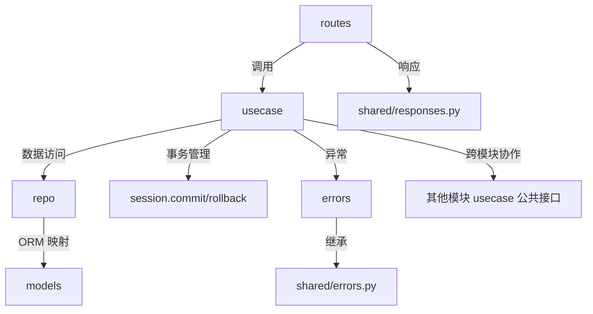

# FastAPI + SQLModel 模块化架构

> `shared/` 提供扁平基础设施，`modules/` 自包含业务逻辑。模块单向依赖 `shared`，事务边界由用例管理，仓储只 `flush` 不 `commit`。

---

## 目录结构

```text
src/
├── main.py                        # FastAPI 应用入口
├── shared/                        # 扁平基础设施，所有模块共享
│   ├── config.py                  # 配置层（pydantic-settings + .env）
│   ├── db.py                      # AsyncEngine + AsyncSession + SessionDep
│   ├── responses.py               # 统一响应体 {code, message, data}
│   └── errors.py                  # 领域异常基类
├── modules/                       # 业务模块，互不直接依赖
│   ├── stock/                     # 库存模块
│   │   ├── entities.py            # 领域实体（业务数据与行为，无 ORM 依赖）
│   │   ├── models.py              # ORM 模型
│   │   ├── repo.py                # 仓储实现（async，仅 flush 不 commit）
│   │   ├── usecase.py             # 用例编排 + 事务边界（commit/rollback）
│   │   ├── schemas.py             # Pydantic 请求/响应模型
│   │   ├── errors.py              # 模块专属异常
│   │   └── routes.py              # FastAPI 路由
│   └── order/
│       └── ...
└── models_generated.py            # sqlacodegen 产物（只读参考）
```

### 模块内部结构

每个业务模块内部扁平组织，自包含业务逻辑：

```text
modules/<模块>/
├── __init__.py            # 公共接口导出
├── entities.py            # 领域实体（业务数据与行为，无 ORM 依赖）
├── models.py              # ORM 模型
├── repo.py                # 仓储实现（async，仅 flush 不 commit）
├── usecase.py             # 用例编排 + 事务边界（commit/rollback）
├── schemas.py             # Pydantic 请求/响应模型
├── errors.py              # 模块专属异常 -> HTTP 映射
└── routes.py              # FastAPI 路由
```

---

## 分层职责与依赖规则



**核心规则：**

| 规则 | 说明 |
|---|---|
| **依赖方向** | `modules → shared` 单向依赖；模块间通过用例公共接口协作 |
| **仓储** | 仓储实现放模块内 `repo.py`，用例**直接依赖仓储具体类**，不建抽象层 |
| **实体** | 领域实体封装业务数据与行为；纯数据传输用 Pydantic schemas |
| **用例拆分** | 按聚合拆分用例类，一个聚合一个用例类 |
| **异步** | 全链路 `async`，数据库访问使用 `AsyncSession` + `create_async_engine` |
| **事务边界** | 事务由用例管理（`commit`/`rollback`），仓储只 `flush` 不 `commit` |
| **配置** | 所有配置经 `shared/config.py` + `.env`，禁止硬编码 |

### 禁止行为

- :no_entry: 路由层直接访问 ORM、数据库或编写 SQL
- :no_entry: 用例层直接调用 `session.execute()` / `session.query()` 等数据访问 API；事务控制（`commit()` / `rollback()`）除外
- :no_entry: 领域实体包含 ORM 映射、数据库或框架相关实现
- :no_entry: 业务模块直接依赖其他业务模块的具体实现
- :no_entry: 模块之间形成循环依赖
- :no_entry: 在 `async` 上下文中执行阻塞式 I/O
- :no_entry: 在代码中硬编码数据库连接串、密钥、Token 等配置
- :no_entry: 仓储不得包含业务规则，仅负责数据持久化
- :no_entry: 用例不得依赖 Web 框架对象（如 `Request`、`Response`、`Depends`）
- :no_entry: 领域层不得依赖 FastAPI、SQLAlchemy、Pydantic 等基础设施框架
- :no_entry: 禁止跨层调用（如路由直接调用仓储、仓储调用用例）

---

## 代码示例

以库存扣减为例，展示模块化架构下各层实现。

### 1. 数据库会话

> `shared/db.py`

```python
from sqlmodel import create_engine, Session
from sqlalchemy.ext.asyncio import create_async_engine, AsyncSession

engine = create_engine("sqlite:///test.db")
async_engine = create_async_engine("sqlite+aiosqlite:///test.db")

async def get_session():
    async with AsyncSession(async_engine) as session:
        yield session
```

### 2. 领域实体

> `modules/stock/entities.py`

无 ORM、无 DB，只处理自身业务逻辑：

```python
class Stock:
    def __init__(self, stock_id: int, quantity: int):
        self.stock_id = stock_id
        self.quantity = quantity

    def deduct(self, num: int):
        if self.quantity < num:
            raise ValueError("库存不足")
        self.quantity -= num
```

### 3. ORM 模型

> `modules/stock/models.py`

仅映射数据库表：

```python
from sqlmodel import SQLModel, Field

class StockModel(SQLModel, table=True):
    __tablename__ = "stock"
    stock_id: int = Field(primary_key=True)
    quantity: int
```

### 4. 仓储实现

> `modules/stock/repo.py`

直接实现数据访问，**不建抽象接口**。只 `flush`，不 `commit`：

```python
from sqlmodel import select
from sqlalchemy.ext.asyncio import AsyncSession
from modules.stock.models import StockModel
from modules.stock.entities import Stock

class StockRepo:
    def __init__(self, session: AsyncSession):
        self.db = session

    async def get_by_id_lock(self, stock_id: int) -> Stock | None:
        sql = select(StockModel).where(StockModel.stock_id == stock_id).with_for_update()
        result = await self.db.exec(sql)
        orm_obj = result.one_or_none()
        if orm_obj is None:
            return None
        return Stock(stock_id=orm_obj.stock_id, quantity=orm_obj.quantity)

    async def save(self, stock: Stock):
        db_row = StockModel(stock_id=stock.stock_id, quantity=stock.quantity)
        await self.db.merge(db_row)
        await self.db.flush()  # 只 flush，不 commit
```

### 5. 用例

> `modules/stock/usecase.py`

编排仓储与实体，管理事务边界：

```python
from sqlalchemy.ext.asyncio import AsyncSession
from modules.stock.repo import StockRepo
from modules.stock.errors import InsufficientStockError

class DeductStockUseCase:
    def __init__(self, session: AsyncSession):
        self.session = session
        self.repo = StockRepo(session)

    async def execute(self, stock_id: int, buy_num: int):
        # 1. 带锁查询
        stock = await self.repo.get_by_id_lock(stock_id)
        if stock is None:
            raise InsufficientStockError(stock_id)
        # 2. 调用实体执行业务逻辑
        stock.deduct(buy_num)
        # 3. 持久化
        await self.repo.save(stock)
        # 4. 事务提交（用例层负责）
        await self.session.commit()
        return stock
```

### 6. 路由

> `modules/stock/routes.py`

```python
from fastapi import APIRouter, Depends
from sqlalchemy.ext.asyncio import AsyncSession
from shared.db import get_session
from modules.stock.usecase import DeductStockUseCase
from modules.stock.schemas import DeductRequest, StockResponse

router = APIRouter(prefix="/stock", tags=["stock"])

@router.post("/deduct", response_model=StockResponse)
async def deduct_stock(req: DeductRequest, session: AsyncSession = Depends(get_session)):
    usecase = DeductStockUseCase(session)
    result = await usecase.execute(req.stock_id, req.num)
    return StockResponse(stock_id=result.stock_id, quantity=result.quantity)
```

---

## 与传统 DDD 分层的对比

| | 传统 DDD 分层 | 模块化架构 |
|---|---|---|
| **仓储抽象** | `domain/repos/` 定义 ABC 接口 | **不需要**，用例直接依赖具体类 |
| **目录组织** | 按层拆分（domain/infra/application） | 按业务模块拆分，每个模块自包含 |
| **依赖注入** | UseCase 依赖抽象接口，运行时注入实现 | UseCase 直接实例化 repo，session 由依赖注入传入 |
| **复杂度** | 高（抽象层 + 实现层 + DI 容器） | 低（无抽象层，直连） |
| **适用场景** | 需要多数据源切换、严格 TDD 的大型项目 | 大多数 FastAPI 项目，尤其是中小型团队 |

---

## 调用链路

路由 → UseCase(session) → Repo(session).flush() → UseCase.commit() → 返回
